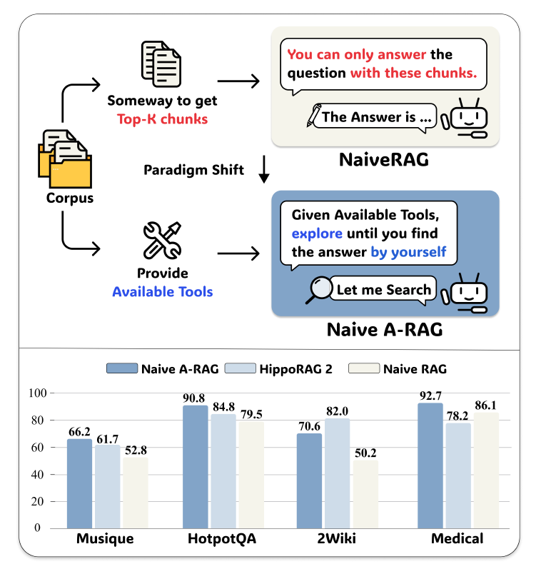
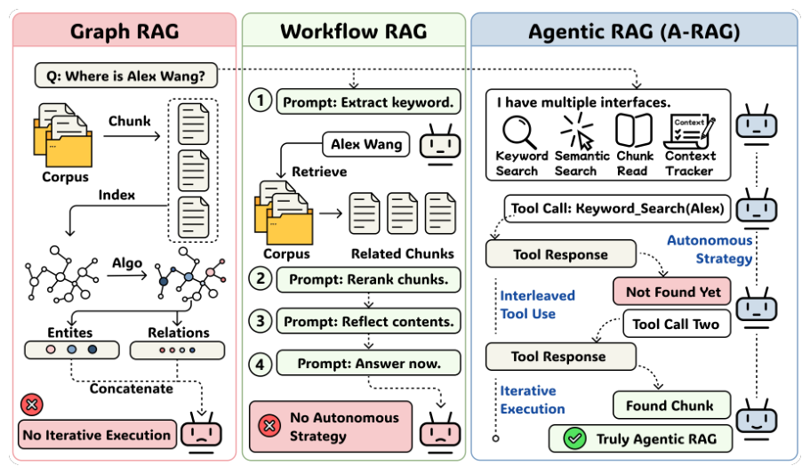
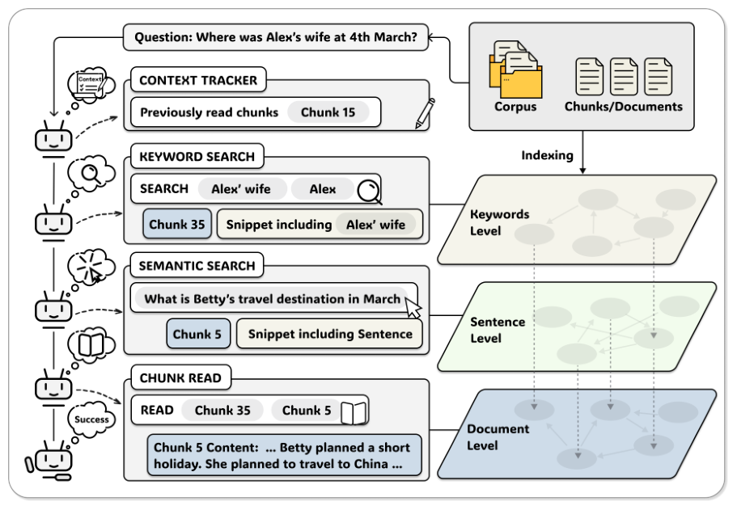
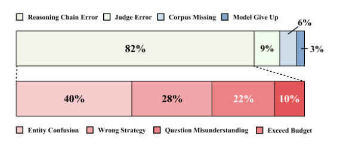
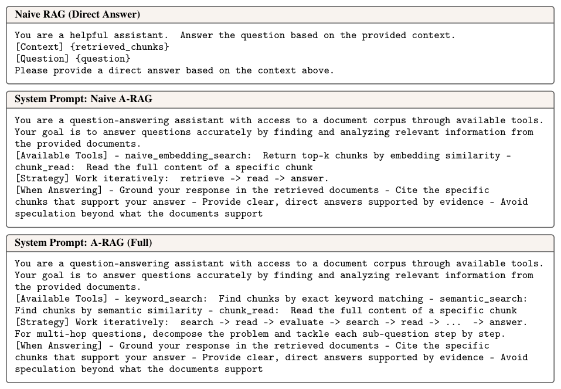
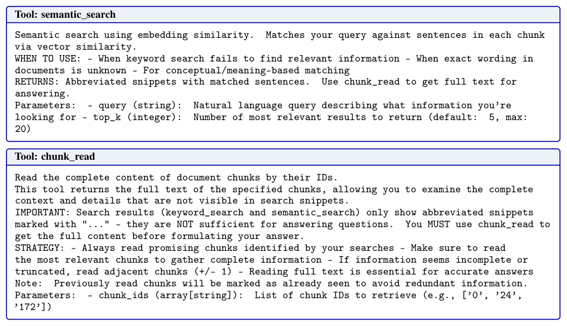

# A-RAG: 階層的検索インターフェースによるエージェント型検索拡張生成の規模拡張

**2026年2月4日**

**Mingxuan Du, Benfeng Xu, Chiwei Zhu, Shaohan Wang, Pengyu Wang, Xiaorui Wang, Zhendong Mao**  
中国科学技術大学（合肥）、Metastone Technology（北京）

> **[CC BY 4.0]**
> [A-RAG: Scaling Agentic Retrieval-Augmented Generation via Hierarchical Retrieval Interfaces](https://arxiv.org/abs/2602.03442)

## 要約 (Abstract)

最先端の言語モデルは、強力な推論能力と長期的なツール利用能力を示している。しかし、既存の検索拡張生成（RAG）システムは、これらの能力を十分に活用できていない。既存システムは依然として2つのパラダイムに依存している。(1) 一回の試行でパッセージを検索し、それらをモデルの入力に結合するアルゴリズムを設計する手法、あるいは (2) あらかじめ定義されたワークフローに従って、ステップバイステップでモデルを実行させる手法である。いずれのパラダイムも、モデルが検索の意思決定に参加することを許容しておらず、モデルの進化に伴う効率的な規模拡張（スケーリング）を妨げている。

本稿では、階層的な検索インターフェースをモデルに直接提供するエージェント型RAGフレームワークである **A-RAG** を提案する。

*図1: 2つのパラダイムの比較とパフォーマンス結果。*

A-RAGは、「キーワード検索（keyword_search）」、「セマンティック検索（semantic_search）」、「チャンク読み取り（chunk_read）」という3つの検索ツールを提供し、エージェントが複数の粒度にわたって適応的に情報を探索・取得することを可能にする。複数のオープンドメイン質問応答（QA）ベンチマークにおける実験の結果、A-RAGは既存の手法と同等あるいはそれ以下の取得トークン量で、一貫して優れた性能を発揮することが示された。これは、A-RAGがモデルの能力を効果的に活用し、異なるRAGタスクに動的に適応できることを証明している。さらに、A-RAGがモデルサイズや推論時計算量（test-time compute）に応じてどのようにスケーリングするかを体系的に調査した。

---

## 目次

- [1. 導入](#1-導入-introduction)
- [2. 関連研究](#2-関連研究-related-work)
- [3. 手法](#3-手法-methodology)
- [4. 実験](#4-実験-experiments)
- [5. 分析と議論](#5-分析と議論-analysis-and-discussion)
- [6. 結論](#6-結論-conclusion)
- [7. 付録](#7-付録-appendix)
- [用語集](#glossary-a-rag)

---

## 1. 導入 (INTRODUCTION)

大規模言語モデル（LLM）の開発は新たな段階に入っており、主要なスケーリングの方向性は、単発のテキスト理解と生成から、複雑な推論やマルチステップのツール強化型インタラクションへと移行しつつある。この変革は、LLMベースのエージェントの能力と実用性を大幅に向上させ、コーディングやディープリサーチなどの領域で顕著な進歩をもたらしている。最先端モデルを統合することで、コーディングエージェントはソフトウェアエンジニアの生産性を劇的に改善し、ディープリサーチエージェントは研究者の調査や情報収集能力を大幅に加速させた。これはパラダイムシフトを意味している。しかし、RAG領域の手法において、この移行に対処したものはほとんどない。

既存のRAG手法は、主に以下の2つのパラダイムに依存している。(1) グラフ構造の有無にかかわらず、一回の試行で複数のパッセージを検索し、それらをモデルの入力に結合するアルゴリズムを設計する手法。(2) あらかじめ定義されたワークフローを用意し、複数のイテレーションを通じてモデルに固定の手順をステップバイステップで実行させる手法である。いずれのアプローチも真の意味で「エージェント型（agentic）」とは言えない。なぜなら、モデルが特定のタスクに基づいてワークフローを適応させたり、異なるインタラクション戦略を選択したり、回答を提供するために十分な証拠が集まったタイミングを判断したりすることが許されていないからである。

図1に示すように、「素朴なRAG（Naive RAG）」と「素朴なエージェント型RAG（Naive Agentic RAG）」の決定的な違いは、エージェントの自律性にある。我々の予備実験では、コーパスから検索するための埋め込みベースのツールを1つ備えただけの最もシンプルなエージェント型RAGでさえ、素朴なRAGや従来のベースラインを一貫して上回ることが示された。この結果は、エージェント型RAGというパラダイムの潜在能力を実証している。

こうした限界に対処するため、我々は階層的検索インターフェースを特徴とするエージェント型RAGフレームワーク、**A-RAG** を提案する。我々の核心的な洞察は、コーパス内の情報は本質的に複数の粒度で整理されているという点にある。すなわち、きめ細かなキーワードレベルの信号から、より抽象的な文レベル、そしてチャンクレベルの表現まで多岐にわたる。これに応じて、エージェントがこれらの粒度を横断して情報にアクセスできるようにする一連の検索ツールを設計した。この階層的なツールセットを備えることで、エージェントは様々なタスクに合わせて多様なワークフローを自発的に汎用化させ、一貫したパフォーマンス向上をもたらすことが観察された。

複数のベンチマークにわたる包括的な実験により、A-RAGが従来の手法を大幅に凌駕することが示された。さらに、推論時スケーリング（Test-Time Scaling）の挙動について体系的な調査を行い、計算資源の増加に伴ってA-RAGの性能が着実に向上することを確認した。これは、我々のフレームワークがモデル能力の進歩とともに効率的にスケールすることを示唆している。要約すると、本稿の貢献は以下の通りである。

*   静的なLLMパイプラインから動的なエージェントベースのシステムへのパラダイムシフトを特定し、RAGをエージェント型フレームワークへと変換する必要性を強調した。
*   階層的検索インターフェースを備えたエージェント型RAGフレームワーク「A-RAG」を導入した。包括的な実験を通じて、より強力なモデルの性能を引き出すには多粒度ツールが不可欠であることを検証した。
*   複数の次元にわたる詳細なスケーリング分析を提示し、我々のフレームワークがモデル能力の進歩や推論時計算量に合わせて効率的にスケールすることを実証した。

*図2: 3つのパラダイム（Graph RAG, Workflow RAG, Agentic RAG）の比較。自律的な戦略、反復的な実行、インターリーブされたツール利用の3原則を特定。*

---

## 2. 関連研究 (RELATED WORK)

図2では、3つのRAGパラダイム（Graph RAG、ワークフロー型RAG、エージェント型RAG（A-RAG））を比較している。我々は真のエージェントとしての自律性を定義する3つの原則を特定し、A-RAGがこれらすべてを満たす唯一のパラダイムであることを実証した。既存手法の各カテゴリにわたる詳細な比較は、付録Aに掲載している。

### 2.1 基本的なRAG (Basic RAG)

初期の研究では、検索（Retrieval）によってモデルが外部知識を取り込み、質問に対してより正確に回答できることが示された（Lewis et al., 2021）。その後の研究では、クエリの書き換え（Chan et al., 2024）、適応型ルーティング戦略（Jeong et al., 2024）、検索品質の評価（Yan et al., 2024）、およびリランキング（再順位付け）メカニズムを通じて、この基盤を継続的に改善してきた。

### 2.2 Graph RAG

2024年、MicrosoftはGraphRAG（Edge et al., 2025）を導入した。これはコーパスからエンティティと関係のグラフを構築し、モデルが大規模な知識ベースを包括的に理解できるように支援するものである。このアプローチは瞬く間に主流のRAGパラダイムへと進化し、ナレッジグラフの構造設計、セマンティックユニットの定義、検索戦略における革新によって研究が進められている（Guo et al., 2025; Shen et al., 2025; Yang et al., 2025b; Song et al., 2025b）。その中でも、RAPTOR（Sarthi et al., 2024）は再帰的な要約を通じて階層的なツリー構造を構築し、マルチレベルの検索を実現している。LightRAG（Guo et al., 2025）は、ローカル検索とグローバル検索の両方のためにナレッジグラフとベクトル検索を組み合わせている。HippoRAG（Gutiérrez et al., 2025a,b）は、海馬のメモリインデックスを模倣し、効率的なマルチホップ推論のためにパーソナライズされたPageRankを利用している。これらの手法はより豊かな構造を取り入れているものの、依然としてモデル駆動の意思決定ではなく、あらかじめ定義された検索アルゴリズムに依存している。最初に取得されたコンテキストが不十分な場合、モデルはその推論能力を活かして、より包括的かつ正確な情報を反復的に収集することができない。

### 2.3 ワークフロー型RAG (Workflow RAG)

LLMベースのエージェントの登場に伴い、多くの研究がRAGへのエージェント的なアプローチを模索してきた。しかし、その多くは、固定の手順をステップバイステップで実行するようにモデルに促す、あらかじめ定義されたエージェント・ワークフローに依存している。そのため、我々はこれらの手法を「ワークフロー型RAG」と呼んでいる。一部の研究では、モデルがこれらのワークフローをより堅牢に遵守できるようにするために、SFT（教師あり微調整）やRL（強化学習）をさらに採用している。トレーニング不要な手法の中では、FLARE（Jiang et al., 2023）は生成の確信度が低下したときに検索をトリガーし、IRCoT（Trivedi et al., 2023）は思考の連鎖（CoT）推論と検索ステップをインターリーブ（交互に配置）させ、RA-ISF（Liu et al., 2024）は反復的な自己フィードバックを通じて複雑なクエリを分解する。マルチエージェント・アプローチは、このパラダイムをさらに拡張している。MA-RAG（Nguyen et al., 2025）は協調的な思考の連鎖を通じて専門エージェントを調整し、RAGentA（Besrour et al., 2025; Chang et al., 2024）は、ハイブリッド検索と引用追跡を組み合わせて質問応答を行う。トレーニングベースの手法では、より小さなモデルでも効果的な検索戦略を学習できることが示されている（Asai et al., 2023; Chan et al., 2024; Chen et al., 2025; Xiong et al., 2025; Jin et al., 2025; Song et al., 2025a; Luo et al., 2025）。これらは洗練されているものの、ワークフローは設計時に固定されたままである。すなわち、モデルはタスクの特性に基づいて戦略を適応させることができない。対照的に、我々は、エージェントにとって使いやすい階層的検索インターフェースがあれば、定義されたワークフローなしでもモデルが自律的に多様なインタラクション戦略を採用でき、様々なタスクの複雑さにわたって、より強力で堅牢なパフォーマンスを発揮できることを実証する。

---

## 3. 手法 (METHODOLOGY)

本セクションでは、モデルに階層的検索インターフェースを提供するエージェント型RAGフレームワーク、**A-RAG** について解説する。図3に示すように、我々のアプローチは3つの主要コンポーネントで構成されている。

*図3: A-RAGフレームワークの概要。エージェントは階層的検索ツール（キーワード検索、セマンティック検索、チャンク読み取り）を反復的に使用してコーパスから情報を収集し、最終的な回答を提供するタイミングを自律的に決定する。*

### 3.1 階層的インデックスの構築 (Hierarchical Index Construction)

効率的な多粒度検索を可能にするために、コーパス情報を異なる抽象化レベルで整理した階層的インデックスを構築する。我々のインデックス作成手順は軽量であり、チャンキング（Chunking）と埋め込み（Embedding）の2つのステージのみで構成される。

**チャンキング (Chunking)**  
LinearRAG（Zhuang et al., 2025）の設定に従い、コーパスを約1,000トークンずつのチャンクに分割する。その際、意味的な一貫性を保つために、チャンクの境界が文の境界と一致するように配慮する。各チャンクは独立したセマンティックユニットとして機能し、専用の検索インターフェースを通じてエージェントが選択的にアクセスできるようにする。

**埋め込み (Embedding)**  
各チャンク $c_i$ について、ルールベースの文分割を用いて文の集合 $\{s_{i,1}, s_{i,2}, \dots, s_{i,n_i}\}$ に分解する。その後、事前学習済みの文エンコーダ $f_{emb}$ を用いて密ベクトル表現を計算する：$v_{i,j} = f_{emb}(s_{i,j})$。

**キーワードレベル**  
キーワードレベルの情報については、事前のインデックス作成を回避している。オフラインフェーズで転置インデックスやナレッジグラフを構築する代わりに、クエリ実行時に直接、完全一致テキストマッチングを行う。この設計上の選択により、グラフベースのアプローチと比較して、インデックス作成時間と計算コストの両方を大幅に削減できる。この軽量なインデックス作成手順を通じて、我々は3つのレベルの情報表現を得る。すなわち、実行時のテキスト検索による精密なエンティティマッチングのための「暗黙的なキーワードレベル」、セマンティック検索のための「文レベルの埋め込み」、そして全コンテンツへのアクセスのための「チャンクレベルのストレージ」である。これらが一体となって、階層的検索インターフェースを支えている。

### 3.2 階層的検索インターフェース (Hierarchical Retrieval Interfaces)

異なる粒度で動作する3つの検索ツールを設計した。これにより、エージェントは各質問の特性に基づいて、最も適切な検索戦略を適応的に選択できる。

**キーワード検索 (Keyword Search)**  
このツールは、特定の用語を含むチャンクを特定するために、厳密な語彙マッチングを行う。エージェントはキーワードリスト $K=\{k_1, k_2, \dots, k_m\}$ と、返す結果の数を指定するパラメータ $k$ を提供する。チャンク $c_i$ の関連性スコアは次のように計算される：
$$Score_{kw}(c_i, K) = \sum_{k \in K} count(k, T_i) \cdot |k| \quad (1)$$
ここで、$count(k, T_i)$ はチャンクテキスト $T_i$ におけるキーワード $k$ の出現頻度を表し、$|k|$ はキーワードの文字長である（長いキーワードほど通常はより具体的であるため、高い重みが付けられる）。マッチした各チャンクについて、少なくとも1つのキーワードを含む文を抽出することで、短縮されたスニペットを作成する：
$$Snippet(c_i, K) = \{s \in Sent(c_i) \mid \exists k \in K, k \subseteq s\} \quad (2)$$
ここで、$Sent(c_i)$ はチャンク $c_i$ 内の文の集合を表す。ツールは上位 $k$ 個のチャンクIDをスニペットと共に返し、エージェントが自律的に次のアクションを決定できるようにする。

**セマンティック検索 (Semantic Search)**  
このツールは、密検索を用いて意味的に類似したパッセージを探す。自然言語クエリ $q$ が与えられると、それをクエリ埋め込み $v_q = f_{emb}(q)$ にエンコードし、すべての文埋め込みとのコサイン類似度を計算する：
$$Score_{sem}(s_{i,j}, q) = \frac{v_{i,j}^T v_q}{\|v_{i,j}\| \|v_q\|} \quad (3)$$
上位にランクされた文を取得し、それらの親チャンクごとに集計する。各チャンクの関連性スコアは、その中の最高スコアを持つ文によって決定される。ツールは上位 $k$ 個のチャンクIDを、各チャンク内でマッチした文をスニペットとして添えて返す。

**チャンク読み取り (Chunk Read)**  
キーワード検索やセマンティック検索から返されたスニペットに基づき、エージェントはどのチャンクを詳細に読む必要があるかを判断し、このツールを使用して完全なコンテンツにアクセスする。また、必要に応じて隣接するチャンクを読み、追加のコンテキストを収集することもできる。

この階層的設計は本質的にエージェントフレンドリーであり、エージェントが自身の判断に基づいて、異なる粒度でコーパス情報にアクセスすることを可能にする。大量のコンテキストを無差別にロードするのではなく、エージェントはオンデマンドで段階的に情報を取得でき、コンテキストのオーバーヘッドを最小限に抑えつつ、必要なときには包括的な証拠を収集できる柔軟性を維持できる。

### 3.3 エージェント・ループ (Agent Loop)

我々の手法は主にインターフェース設計とA-RAGにおける推論時スケーリング挙動の調査に焦点を当てているため、複雑なオーケストレーション・メカニズムによる交絡因子を最小限に抑えるべく、意図的に最もシンプルなエージェント・ループのバックボーンを採用している。

**エージェント・ループ**  
ReAct風のフレームワーク（Yao et al., 2023）を採用し、モデルは推論とツール呼び出しを交互に反復的に実行する。各イテレーションにおいて、エージェントは呼び出すツールを1つ選択し、結果を観察して、次のアクションを決定する。インターフェース構成の違いがエージェントの行動にどのように影響するかを明確に観察するため、並列ツール呼び出しやその他の洗練された設計は意図的に避けている。回答を生成せずに最大イテレーション予算に達した場合、それまでに収集した情報に基づいて回答を統合するようにエージェントに促す。

**コンテキスト・トラッカー (Context Tracker)**  
情報の重複取得や不要なトークン消費を防ぐため、検索プロセス中にどのチャンクが読み取られたかを記録するコンテキスト・トラッカーを維持する。具体的には、以前にアクセスされたチャンクのIDの集合 $C_{read} = \{c_{i_1}, c_{i_2}, \dots, c_{i_k}\}$ を追跡する。エージェントが $c_i \in C_{read}$ であるチャンクを読み取ろうとした場合、全文を再度返す代わりに、チャンク読み取りツールは「このチャンクは以前に読み取り済みです」という通知メッセージを返し、追加トークンを一切消費しない。このメカニズムは計算コストを削減するだけでなく、エージェントが同じパッセージを繰り返し調べるのではなく、コーパスの多様な部分を探索することを促す。

---

## 4. 実験 (EXPERIMENTS)

本セクションでは、複数のベンチマークにわたってA-RAGの有効性を評価し、その推論時スケーリング挙動を分析するための包括的な実験を行う。

### 4.1 実験設定 (Experimental Setting)

**データセット**  
A-RAGを、広く用いられている4つのマルチホップQAデータセット（HotpotQA, 2WikiMultiHopQA, MuSiQue, GraphRAG-Bench）で評価する。LinearRAG（Zhuang et al., 2025）の実験設定に従い、異なる手法間での公平な比較を確実にするため、同じコーパスと質問を使用する。

**ベースライン**  
比較対象となるすべての手法を2つのグループに分類する。(i) **Vanillaベースライン**: 直接のゼロショットLLM推論、および素朴なRAG（Naive RAG）手法を含む。(ii) **Graph-RAGおよびワークフロー型RAG**: GraphRAG (Edge et al., 2025)、HippoRAG2 (Gutiérrez et al., 2025a)、LinearRAG (Zhuang et al., 2025) を含む代表的なグラフ強化アプローチ、および FaithfulRAG (Zhang et al., 2025a)、MA-RAG (Nguyen et al., 2025)、RAGentA (Besrour et al., 2025) を含むワークフローベースの手法をベンチマークとする。これらを、単一の埋め込み検索ツールのみを備えた「A-RAG (Naive)」および「A-RAG (Full)」と比較する。

**評価指標**  
LinearRAGに従い、エンドツーエンドのQA評価のために2つの指標を用いる。(1) **LLM評価精度 (LLM-Acc)**: 予測と正解の間の意味的な同等性を判定するLLMベースの指標。(2) **包含一致精度 (Contain-Acc)**: 生成された回答内に正解が含まれているかを検証する指標。短文回答のHotpotQA, 2WikiMultiHopQA, MuSiQueについては両方の指標を報告する。長文の記述式回答となるGraphRAG-Benchについては、長大な正解文が生成回答内に逐語的に現れることは稀であり Contain-Acc が有用ではないため、LLM-Acc のみを報告する。

**実装詳細**  
すべての手法を、GPT-4o-miniおよびGPT-5-mini（OpenAI, 2025a）をバックボーンLLMとして評価する。密検索については、LinearRAGを除くすべての手法で Qwen3-Embedding-0.6B を使用し、top-k結果として $k=5$ を用いる。RAG手法が異なる能力レベルでどのように機能するかを包括的に捉えるため、以前のモデルと最新の推論モデルの両方を意図的に含めている。LLMベースの評価については、人間による検証に基づき精度と安定性の向上が確認された GPT-5-mini をジャッジとして使用する。

---

### 4.2 主要な結果 (Main Results)

表1は、すべてのベンチマークにおける主要な実験結果を示している。

**表1: ベンチマークにおける精度（%）の比較（抜粋）**
| モデル / 手法 | MuSiQue (LLM-Acc) | HotpotQA (LLM-Acc) | 2Wiki (LLM-Acc) |
| :--- | :---: | :---: | :---: |
| **GPT-4o-mini** | | | |
| Naive RAG | 38.6 | 74.5 | 42.6 |
| A-RAG (Naive) | 43.8 | 76.6 | 52.3 |
| **A-RAG (Full)** | **46.1** | **77.1** | **60.2** |
| **GPT-5-mini** | | | |
| Naive RAG | 52.8 | 81.2 | 50.2 |
| A-RAG (Naive) | 66.2 | 90.8 | 70.6 |
| **A-RAG (Full)** | **74.1** | **94.5** | **89.7** |

実験から得られた3つの重要な観察事項を以下に挙げる。

**素朴な検索手法は依然として堅牢なベースラインである**  
GPT-5-miniをジャッジとし、Qwen3-Embeddingを密検索に使用した統一的な評価設定の下で、素朴なベースラインは GPT-4o-mini および GPT-5-mini の両方のバックボーンにわたって堅牢な性能を示した。既存の Graph-RAG および ワークフロー型RAG 手法は、すべてのデータセットにおいてこれらシンプルなベースラインを一貫して上回ることはできなかった。

**Naive A-RAGはエージェント型RAGの新たな強力なベースラインを確立する**  
単一の埋め込みベースの検索ツールのみを備えた簡略化バリアントである A-RAG (Naive) は、複数のデータセットで既存の Graph-RAG や ワークフロー型RAG 手法を凌駕し、エージェント型パラダイム固有の優位性を実証した。この優位性は、バックボーンを GPT-5-mini に切り替えた際により顕著になった。この結果は、洗練された多粒度ツールがなくても、モデルに検索の意思決定における大きな自律性を与えることが、固定の検索アルゴリズムに頼るよりも優れた性能をもたらすことを示唆している。

**A-RAGは階層的検索インターフェースを通じて既存のRAG手法を凌駕する**  
A-RAGは、ツール利用能力を備えた推論モデル向けに設計されており、LLM分野の現在の発展トレンドと一致している。GPT-4o-miniをバックボーンとした場合、A-RAG (Full) は5つのデータセットのうち3つで最高の性能を達成した。より強力な推論およびツール呼び出し能力を持つ GPT-5-mini に切り替えると、A-RAG (Full) はすべてのベンチマークで優れた結果を収めた。ベースライン手法と Naive A-RAG の両方に対する A-RAG の一貫した改善は、A-RAGフレームワークがエージェントフレンドリーであることを証明している。これにより、モデルはその推論能力を活用して戦略を動的に調整し、タスクの要件に基づいて異なるインターフェースを調整することができ、結果としてより高い性能を実現できる。

### 4.3 アブレーション研究 (Ablation Study)

各検索ツールの貢献を調査するため、A-RAG (Full) から個々のコンポーネントを体系的に削除するアブレーション実験を行った。以下の3つのバリアントを評価した。(i) **w/o Keyword Search** および **w/o Semantic Search**: エージェントのツールキットから対応する検索ツールを直接削除したもの。(ii) **w/o Chunk Read**: キーワード検索およびセマンティック検索のレスポンス（スニペット）をチャンク全文に置き換え、チャンク読み取りツールを完全に削除したもの。

表2に示すように、完全な階層構成が最適な総合性能を達成している。A-RAG (Full) は、ほとんどのベンチマークで一貫して最高の結果を得た。セマンティック検索またはキーワード検索のいずれかを削除すると性能が低下し、マルチホップ検索タスクにおける多粒度情報の重要性が浮き彫りになった。w/o Chunk Read の性能が A-RAG (Full) よりも劣っていることは、我々の段階的な情報取得設計により、エージェントが自律的に判断を下し、最も関連性の高いコンテンツを正確に読み取ることが可能になっていることを示している。この設計は、エージェントの自律性を高めるだけでなく、モデルが最も関連性の高いチャンクのみを選択的に全文読み取りすることを可能にし、無関係なコンテンツによって導入されるノイズを回避している。

---

## 5. 分析と議論 (ANALYSIS AND DISCUSSION)

新パラダイムとしてのA-RAGの利点と特徴を理解するため、本セクションではさらなる実験と分析を行う。

### 5.1 推論時スケーリング分析 (Test-Time Scaling Analysis)

A-RAGはLLMに検索決定の大きな自律性を与えるため、推論時の計算資源を増やすことでフレームワークの性能をさらに拡張できる。図4に示すように、MuSiQueの最初の300タスクで実験を行った結果、最大ステップ数（max-step）と推論努力量（reasoning effort）の両方を増やすことが、モデルの性能向上に効果的であることがわかった。

*図4: MuSiQue-300における推論時スケーリング分析。左2つ：GPT-5-miniとGPT-4o-miniにおけるLLM-Acc対最大ステップ数。右2つ：GPT-5-miniとGPT-5におけるLLM-Acc対推論努力量。*

5ステップから20ステップに拡張した場合、GPT-5-miniは約8%向上したが、GPT-4o-miniは約4%の向上にとどまった。これは、より強力な推論モデルの方が長期的な探索に適していることを示唆している。推論努力量を最小から最大にスケールさせた場合、GPT-5-mini と GPT-5 の両方が約25%という大幅な向上を達成した。これらの結果は、A-RAGが推論時計算量を効果的に活用できることを示しており、将来の発展に向けた有望なパラダイムであることを位置づけている。

### 5.2 コンテキスト効率分析 (Context Efficiency Analysis)

複雑なエージェント・システムにRAGを統合する場合、コンテキストの効率性は極めて重要である。各手法がコンテキストをいかに効率的に利用しているかを測定するため、コーパスから取得されたトークン量を分析した（表3）。

**表3: 取得トークン量の比較（GPT-5-mini、低いほど効率的）**
| 手法 | MuSiQue | HotpotQA | 2Wiki |
| :--- | :---: | :---: | :---: |
| Naive RAG | 5,387 | 5,358 | 5,506 |
| GraphRAG | 9,234 | 8,744 | 4,201 |
| A-RAG (Naive) | 56,360 | 27,455 | 45,406 |
| **A-RAG (Full)** | **5,663** | **2,737** | **2,930** |

**A-RAGは高いコンテキスト効率で優れた精度を達成する**  
取得するコンテンツが多いほど性能が向上するという直感に反して、A-RAG (Full) は従来のRAG手法と同等あるいはそれ以下のトークン量を取得しながら、優れた精度を達成している。

**階層的インターフェースがコンテキスト効率の鍵である**  
A-RAG (Naive) と A-RAG (Full) を比較すると、際立ったパターンが見て取れる。A-RAG (Naive) は A-RAG (Full) よりも多くのトークンを取得しているにもかかわらず、性能は低い。これは、我々の階層的インターフェース設計を正当化するものである。段階的な情報開示により、モデルに大きな自律性を与えつつ、無関係なコンテンツを避けることができているのである。

### 5.3 失敗モード分析 (Failure Mode Analysis)

MuSiQueにおけるA-RAGの誤回答事例のうち、最初の100件を手動でレビューし、2レベルのエラータイプに分類した（図5）。

*図5: A-RAGの失敗モード分布。上：主要カテゴリ。下：推論チェーンエラーの内訳。*

失敗の大部分は「推論チェーンのエラー」に起因している。その中でも「エンティティの混同」が最も一般的であり、次いで「誤った検索戦略」や「質問の誤解」も相当な割合を占めている。

---

## 6. 結論 (CONCLUSION)

本研究において、我々は「エージェント型RAG」をRAGにおける根本的なパラダイムシフトとして認識した。キーワード、文、チャンクの各レベルでLLMが自律的にコーパス情報にアクセスすることを可能にする、階層的検索インターフェースを備えたエージェント型RAGフレームワーク「A-RAG」を導入した。広範な実験により、A-RAGが多様なベンチマークにおいて既存の Graph-RAG や ワークフロー型RAG 手法を一貫して上回ることが示され、我々の分析によってその効率的な推論時スケーリング挙動が検証された。我々の知見は、将来の研究が複雑な検索アルゴリズムではなく、エージェントフレンドリーなインターフェースの設計に焦点を当て、言語モデルと外部知識ソースの間の新しいインタラクション・パラダイムを探求すべきであることを示唆している。

### 限界事項 (Limitations)

本研究は主に、従来のRAGからエージェント型RAGへのパラダイムシフトを浮き彫りにし、階層的インターフェースを有望な拡張方向として示すことを目的としている。しかし、考えられるすべてのツール設計を網羅的に列挙したり、異なるツールのサブセットとそのエージェント行動への影響を体系的に比較したりはしていない。多様なツール構成にわたる包括的なアブレーション研究は、最適なインターフェース設計に関するより深い洞察を提供できる可能性があり、今後の課題とする。

計算資源の制約により、GPT-5やGemini-3などのより大規模で強力なモデルでのフレームワークの検証は行っていない。A-RAGは強力なツール利用能力を持つ推論モデル向けに特別に設計されているため、これらの最先端モデルでは性能向上がより顕著になると予想されるが、実証的な検証は今後の課題である。

さらに、マルチホップQAベンチマークで強力な結果を示したが、事実検証、対話システム、長文生成などの他の知識集約型タスクへのA-RAGの汎用性については、さらなる調査が必要である。

### 倫理的配慮 (Ethical Considerations)

本研究で使用されたすべてのデータセットは、適切な倫理的配慮を持って先行研究によって収集・処理された、公開されているベンチマークである。本研究は大規模言語モデルにおける検索拡張生成を改善するための基礎研究に焦点を当てており、新たなデータの収集や人間を対象とした調査は含まれていない。RAGシステムへの手法的な貢献として、我々のアプローチは、基盤となる言語モデルに固有のリスクを超えた、追加の倫理的リスクを導入することはない。

---

## 7. 付録 (APPENDIX)

### A. RAG手法の自律性の比較 (Comparison of RAG Method Autonomy)

我々は、RAG手法が真にエージェント型であるかどうかを判断するための3つの主要原則を特定した。
1.  **自律的な戦略 (Autonomous Strategy)**: 単一の事前指定されたワークフローに制約されたり、外部のルールや評価器によって決定されたりするのではなく、LLMがハイレベルな戦略（いつ、どのように検索・分解・検証・再計画するかなど）を動的に選択・整理できるか。
2.  **反復的な実行 (Iterative Execution)**: 厳密に一回限りの実行ではなく、多ラウンドの実行をサポートし、中間結果に基づいてラウンド数を適応させることができるか。
3.  **インターリーブされたツール利用 (Interleaved Tool Use)**: 各ツール呼び出しが、常に同じ順序で実行される固定のツールチェーンではなく、以前のツール出力からの観察に基づいた「アクション→観察→推論」のループに従っているか。

表4では、これら3つの次元にわたって既存のRAG手法を比較している。既存手法は1つまたは2つの原則を部分的に満たす場合があるが、A-RAGは3つすべてを完全に満たす唯一の手法である。

### B. ベースラインの再現詳細 (Baseline Reproduction Details)

すべてのベースラインの結果は、統一された評価設定の下でローカルに再現された。すべての手法で検索には top-k=5 を使用し、推論の途絶を防ぐために max_tokens ≥ 16384 とした。

*   **GraphRAG**: ドキュメントから階層的なコミュニティ構造を持つナレッジグラフを構築。
*   **HippoRAG2**: 人間の海馬のメモリインデックスを模倣し、パーソナライズされたPageRankを用いて効率的なマルチホップ推論を可能にする。
*   **LinearRAG**: 関係抽出をエンティティ抽出に置き換えることでグラフ構築を簡素化。
*   **FaithfulRAG**: 自己事実マイニング、矛盾の特定、推論の統合を通じて、取得されたコンテンツとモデルの知識との間の矛盾を解決する。
*   **MA-RAG**: 専門エージェント（プランナー、ステップ定義者、抽出者、QA）がCoT推論を通じて協力するマルチエージェント・フレームワーク。
*   **RAGentA**: ハイブリッド検索、反復的なドキュメントフィルタリング、引用属性付きの回答生成を組み合わせたマルチエージェント・システム。

### C. エージェント・ループのアルゴリズム (Agent Loop Algorithm)

アルゴリズム1は、A-RAGのエージェント・ループの疑似コードである。エージェントはメッセージ履歴 $M_{msg}$ と、コンテキストを追跡するための既読チャンク集合 $C_{read}$ を維持する。各イテレーションで、LLM $M$ はメッセージ履歴と利用可能なツール $T$ を受け取り、ツールを呼び出すか最終回答を返すかを決定する。ツールが呼び出されると、その結果がメッセージ履歴に追加される。このループは、エージェントが回答を生成するか、最大イテレーション制限 $L$ に達するまで続く。

### D. 失敗モードの詳細 (Failure Mode Details)

素朴なRAGからエージェント型RAGへのパラダイムシフトに伴い、失敗モードがどのように変化するかを理解するため、誤回答事例の分析を行った。

**分析の要点:**
*   **ボトルネックの変化**: 素朴なRAGでは、失敗の約50%が検索の限界（ドキュメントが見つからない）に起因していた。対照的に、A-RAGの支配的な失敗モードは「推論チェーンのエラー」であり、ボトルネックが「ドキュメントは見つけたが、推論を誤った」という点に移行している。
*   **エンティティの混同**: すべてのデータセットにおいて、エンティティの混同が最大の二次失敗モードであった。これは、取得されたコンテキストから正しいエンティティを曖昧さなく抽出する能力の向上が、今後の重要な最適化方向であることを示唆している。

### E. プロンプトテンプレートとツール説明 (Prompt Templates and Tool Descriptions)

エージェント型RAGパラダイムのシンプルさと有効性を示すため、意図的に最小限のシステムプロンプトを使用している。図6に示すように、すべての構成で基本的な指示構造は共通しており、利用可能なツールと戦略の説明のみが異なっている。

*図6: 異なるRAG構成（Naive RAG, Naive A-RAG, A-RAG Full）のためのシステムプロンプトの比較。*

エージェントに提供された完全なツールの説明（キーワード検索、セマンティック検索、チャンク読み取り）については、図7および図8を参照されたい。

*図7: ツールの説明（パート1）。上：Naive A-RAG用の単一検索ツール。下：完全一致テキストマッチング用のキーワード検索ツール。*

*図8: ツールの説明（パート2）。上：意味ベースの検索ツール。下：ドキュメントの全文にアクセスするためのチャンク読み取りツール。*

---

# Glossary: A-RAG

| English Term | Japanese Translation | Notes |
|--------------|----------------------|-------|
| Agentic RAG | エージェント型RAG | エージェントが自律的に検索を制御するRAG。 |
| Hierarchical Retrieval Interfaces | 階層的検索インターフェース | 粒度の異なる複数の検索手段。 |
| Keyword Search | キーワード検索 | BM25等を用いた単語一致検索。 |
| Semantic Search | セマンティック検索 | 埋め込みベクトルを用いた意味的な検索。 |
| Chunk Read | チャンク読み取り | 特定のコンテキストブロックを読み込むツール。 |
| Granularity | 粒度 | 情報の細かさ（文、チャンク等）。 |
| Scaling | スケーリング / 規模拡張 | モデルサイズや計算量の増大に伴う性能向上。 |
| Test-Time Compute | 推論時計算量 / テスト時計算量 | 回答生成時に費やされる計算資源（推論ステップ数等）。 |
| Open-domain QA | オープンドメイン質問応答 | 広範な知識ベースから回答を探すタスク。 |
| Naive RAG | 素朴なRAG / 基本的なRAG | 単発検索のみを行う標準的なRAG。 |
| Workflow RAG | ワークフロー型RAG | 固定の処理手順に従うエージェント型RAG。 |
| Retrieval-Augmented Generation (RAG) | 検索拡張生成 | |
