# LightRAG: シンプルかつ高速な検索拡張生成

**著者**: Zirui Guo, Lianghao Xia, Yanhua Yu, Tu Ao, Chao Huang  
**所属**: 北京郵電大学, 香港大学  

>  
> [LightRAG: Simple and Fast Retrieval-Augmented Generation](https://arxiv.org/abs/2410.05779)

---

## 要約 (Abstract)
検索拡張生成 (RAG) システムは、外部知識ソースを統合することで大規模言語モデル (LLM) を強化し、ユーザーのニーズに合わせたより正確で文脈に即した回答を可能にします。しかし、既存のRAGシステムには、フラットなデータ表現への依存や、不十分なコンテキスト認識といった重大な制限があり、複雑な相互依存関係を捉えきれず、断片的な回答に陥ることがあります。

これらの課題に対処するため、我々はテキストのインデックス作成と検索プロセスにグラフ構造を組み込んだ「LightRAG」を提案します。この革新的なフレームワークは、低レベル (low-level) の知識発見と高レベル (high-level) の知識発見の両方から包括的な情報を取得する、2レベル検索システムを採用しています。さらに、グラフ構造とベクトル表現の統合により、関連するエンティティとその関係の効率的な検索が容易になり、文脈上の関連性を維持しながら応答時間を大幅に改善します。

この機能は、新しいデータのタイムリーな統合を保証する逐次更新アルゴリズムによってさらに強化され、急速に変化するデータ環境においてもシステムが有効かつ機敏であり続けることを可能にします。広範な実験的検証により、既存のアプローチと比較して検索の精度と効率が大幅に向上することが実証されました。我々はLightRAGをオープンソース化しており、以下のリンクで公開しています: [https://github.com/HKUDS/LightRAG](https://github.com/HKUDS/LightRAG)

---

## 1. はじめに (Introduction)
検索拡張生成 (RAG) システムは、外部知識ソースを統合することで大規模言語モデル (LLM) を強化するために開発されてきました (Sudhi et al., 2024; Es et al., 2024; Salemi & Zamani, 2024)。この革新的な統合により、LLMはより正確で文脈に即した回答を生成できるようになり、実世界のアプリケーションにおける実用性が大幅に向上しました。特定のドメイン知識に適応することで (Tu et al., 2024)、RAGシステムは提供される情報が適切であるだけでなく、ユーザーのニーズに合わせたものになることを保証します。さらに、RAGシステムは最新の情報へのアクセスを提供しますが (Zhao et al., 2024)、これは急速に進化する分野において非常に重要です。

チャンキング (Chunking) は、検索拡張生成プロセスを促進する上で重要な役割を果たします。大規模な外部テキストコーパスを、より管理しやすい小さなセグメントに分割することで、チャンキングは情報検索の精度を大幅に向上させます。このアプローチにより、よりターゲットを絞った類似性検索が可能になり、取得されたコンテンツがユーザーのクエリに直接関連することを保証します。

しかし、既存のRAGシステムにはパフォーマンスを妨げる主要な制限があります。
第一に、多くの手法はフラットなデータ表現に依存しており、エンティティ間の複雑な関係に基づいて情報を理解し取得する能力が制限されています。
第二に、これらのシステムは、さまざまなエンティティとその相互関係にわたって一貫性を維持するために必要なコンテキスト認識に欠けていることが多く、その結果、ユーザーのクエリに完全に対処できない回答が生成されることがあります。

例えば、「電気自動車の普及は都市の空気質や公共交通インフラにどのような影響を与えるか？」というユーザーの質問を考えてみましょう。既存のRAG手法は、電気自動車、大気汚染、公共交通機関の課題に関する個別の文書を取得するかもしれませんが、これらの情報を一貫した回答に統合することに苦労するでしょう。電気自動車の採用が空気質をどのように改善し、それが結果として公共交通計画にどのように影響するかを説明できない可能性があります。その結果、ユーザーはこれらのトピック間の複雑な相互依存関係を適切に捉えていない、断片的な回答を受け取ることになります。

これらの制限に対処するために、我々はテキストのインデックス作成と関連情報の検索にグラフ構造を組み込むことを提案します。グラフは、異なるエンティティ間の相互依存関係を表現するのに特に効果的であり (Rampášek et al., 2022)、関係のよりニュアンス豊かな理解を可能にします。グラフベースの知識構造の統合は、複数のソースからの情報を一貫した、コンテキスト豊かな回答に統合することを容易にします。

これらの利点にもかかわらず、変化するクエリボリュームを効率的に処理し、高速でスケーラブルなグラフ強化型RAGシステムを開発することが極めて重要です。本研究では、以下の3つの主要な課題に取り組むことで、効果的かつ効率的なRAGシステムを実現します：
i) **包括的な情報検索**: すべての文書から相互依存するエンティティの全コンテキストを捉える、包括的な情報検索を保証する。
ii) **検索効率の向上**: グラフベースの知識構造上での検索効率を改善し、応答時間を大幅に短縮する。
iii) **新しいデータへの迅速な適応**: 新しいデータの更新に素早く適応できるようにし、動的な環境においてもシステムが関連性を維持できるようにする。

概説された課題に対応して、我々はグラフベースのテキストインデックス作成パラダイムとデュアルレベル検索フレームワークをシームレスに統合したモデルである「LightRAG」を提案します。この革新的なアプローチにより、エンティティ間の複雑な相互依存関係を捉えるシステムの能力が向上し、より一貫性のある文脈豊かな回答が得られます。

LightRAGは、効率的なデュアルレベル検索戦略を採用しています：
- **ローレベル検索 (low-level retrieval)**: 特定のエンティティとその関係に関する正確な情報に焦点を当てる。
- **ハイレベル検索 (high-level retrieval)**: より広範なトピックやテーマを網羅する。

詳細な検索と概念的な検索の両方を組み合わせることで、LightRAGは多様なクエリに効果的に対応し、ユーザーがそれぞれの特定のニーズに合わせた、関連性の高い包括的な回答を受け取れるようにします。さらに、グラフ構造とベクトル表現を統合することで、我々のフレームワークは、構築された知識グラフからの関連する構造情報を通じて結果の包括性を高めながら、関連するエンティティと関係の効率的な検索を促進します。

本研究の主要な貢献を以下に要約します：
- **全般的な側面**: 既存手法の制限を克服するために、グラフ強化型RAGシステムを開発することの重要性を強調します。グラフ構造をテキストインデックスに統合することで、エンティティ間の複雑な相互依存関係を効果的に表現し、関係の深い理解を育み、一貫した文脈豊かな回答を可能にします。
- **手法**: 効率的で適応性のあるRAGシステムを可能にするために、デュアルレベル検索パラダイムとグラフ強化型テキストインデックスを統合したLightRAGを提案します。このアプローチは、包括的でコスト効率の高い検索のために、ローレベルとハイレベルの両方の情報を取得します。インデックス全体を再構築する必要をなくすことで、LightRAGは計算コストを削減し適応を加速させます。また、その逐次更新アルゴリズムにより、新しいデータのタイムリーな統合が保証され、動的な環境での有効性が維持されます。
- **実験結果**: 既存のRAGモデルと比較してLightRAGの有効性を評価するために、広範な実験が行われました。これらの評価は、検索の精度、モデルのアブレーション、応答効率、新しい情報への適応性など、いくつかの主要な次元に焦点を当てました。結果は、ベースライン手法と比較して大幅な改善を示しました。

---

## 2. 検索拡張生成 (Retrieval-Augmented Generation)

検索拡張生成 (RAG) は、ユーザーのクエリを外部知識データベースから提供される関連文書のコレクションと統合し、以下の2つの必須要素を組み込んでいます：
1. **検索コンポーネント (Retrieval Component)**: 外部知識データベースから関連する文書や情報を取得する責任を負います。入力クエリに基づいて、最も適切なデータを特定し取得します。
2. **生成コンポーネント (Generation Component)**: 検索プロセスの後、取得された情報を利用して、一貫性があり文脈に関連した回答を生成します。言語モデルの能力を活用して、意味のある出力を生成します。

形式的には、このRAGフレームワーク（$M$ と表記）は以下のように定義できます：

$M = \left( G, R = (\phi, \psi) \right), \quad M(q; D) = G\left( q, \psi(q; \hat{D}) \right), \quad \hat{D} = \phi(D) \quad (1)$

ここで、$G$ と $R$ はそれぞれ生成モジュールと検索モジュールを表し、$q$ は入力クエリ、$D$ は外部データベースを指します。検索モジュール $R$ には、主に2つの機能が含まれています：
- **データインデクサー $\phi(\cdot)$**: 外部データベース $D$ に基づいて特定のデータ構造 $\hat{D}$ を構築することを含みます。
- **データリトリーバー $\psi(\cdot)$**: インデックス化されたデータに対してクエリを比較することで、関連文書（「関連文書」とも呼ばれる）を取得します。

$\psi(\cdot)$ を通じて取得された情報と初期クエリ $q$ を活用することで、生成モデル $G(\cdot)$ は、高品質で文脈に関連した回答を効率的に生成します。

本研究では、効率的かつ効果的な検索拡張生成 (RAG) システムに不可欠な以下の主要ポイントをターゲットとしています：
- **包括的な情報検索**: インデックス作成機能 $\phi(\cdot)$ は、グローバルな情報を抽出するのに長けていなければなりません。これは、クエリに対して効果的に回答するモデルの能力を高めるために極めて重要です。
- **効率的で低コストな検索**: インデックス化されたデータ構造 $\hat{D}$ は、大量のクエリを効果的に処理するために、迅速かつコスト効率の高い検索を可能にしなければなりません。
- **データ変更への迅速な適応**: 外部知識ベースからの新しい情報を組み込むために、データ構造を迅速かつ効率的に調整できる能力は、絶えず変化する情報環境においてシステムを最新かつ適切に保つために不可欠です。

---

## 3. LightRAGのアーキテクチャ (The LightRAG Architecture)

### 3.1 グラフベースのテキストインデックス作成 (Graph-Based Text Indexing)

**グラフ強化型エンティティおよび関係性の抽出 (Graph-Enhanced Entity and Relationship Extraction)**
我々のLightRAGは、文書を管理しやすい小さな断片（チャンク）に分割することで、検索システムを強化します。この戦略により、文書全体を分析することなく、関連情報への迅速な特定とアクセスが可能になります。次に、LLMを活用して、さまざまなエンティティ（例：名前、日付、場所、イベント）とそれらの間の関係性を特定し抽出します。このプロセスを通じて収集された情報は、文書コレクション全体のつながりと洞察を強調する包括的な知識グラフの作成に使用されます。このグラフ生成モジュールを形式的に以下のように表します：

$$\hat{D} = (\hat{V}, \hat{E}) = 	ext{Dedupe} \circ 	ext{Prof}(V, E), \quad V, E = \cup_{D_i \in D} 	ext{Recog}(D_i) \quad (2)$$

ここで、$\hat{D}$ は結果として得られる知識グラフを表します。このデータを生成するために、生のテキスト文書 $D_i$ に対して主に3つの処理ステップを適用します。これらのステップでは、テキストの分析と処理のためにLLMを使用します。この部分のプロンプトテンプレートと具体的な設定の詳細については、付録 7.3.2 を参照してください。グラフベースのテキストインデックス作成パラダイムで使用される機能は、以下の通り説明されます：

- **エンティティと関係性の抽出 $	ext{R}(\cdot)$**: この機能は、テキストデータ内のエンティティ（ノード）とその関係性（エッジ）を特定するようLLMに促します。例えば、「循環器内科医は症状を評価して潜在的な心臓の問題を特定する」というテキストから、「循環器内科医 (Cardiologists)」と「心臓病 (Heart Disease)」というエンティティ、および「循環器内科医は心臓病を診断する」といった関係性を抽出できます。効率を向上させるために、生のテキスト $D$ は複数のチャンク $D_i$ に分割されます。
- **キー・バリューペア生成のためのLLMプロファイリング $	ext{P}(\cdot)$**: LLMを活用したプロファイリング機能 $	ext{P}(\cdot)$ を採用し、エンティティノード $V$ および関係エッジ $E$ ごとにテキストのキー・バリューペア $(K, V)$ を生成します。各インデックスキーは、効率的な検索を可能にする単語または短いフレーズであり、対応する値は、テキスト生成を支援するために外部データから関連するスニペットを要約したテキスト段落です。エンティティはその名前を唯一のインデックスキーとして使用しますが、関係性はLLMによる強化から派生した、関連するエンティティからのグローバルなテーマを含む複数のインデックスキーを持つ場合があります。
- **グラフ操作最適化のための重複排除 $	ext{D}(\cdot)$**: 最後に、文書の異なるセグメントから得られた同一のエンティティと関係性を特定し統合する重複排除機能 $	ext{D}(\cdot)$ を実装しています。

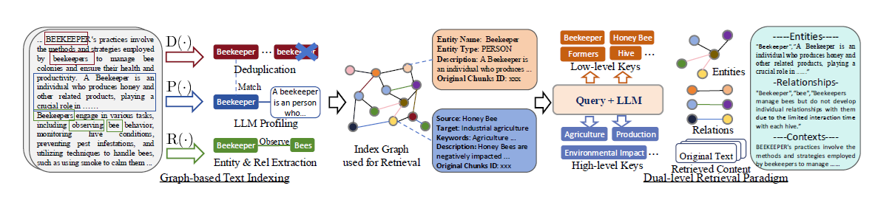
*図1: 提案するLightRAGフレームワークの全体アーキテクチャ。*

---

LightRAGは、グラフベースのテキストインデックス作成パラダイムを通じて2つの利点を提供します。
第一に、**包括的な情報の理解**です。構築されたグラフ構造により、マルチホップ（複数段）のサブグラフからグローバルな情報を抽出することが可能になり、複数の文書チャンクにまたがる複雑なクエリを処理する能力が大幅に向上します。
第二に、**検索性能の向上**です。グラフから派生したキー・バリュー形式のデータ構造は、迅速かつ正確な検索のために最適化されています。これは、既存の手法で一般的に使用されている精度の低いエンベディング・マッチング手法や、非効率なチャンク走査技術に対する優れた代替手段となります。

**増分的な知識ベースへの迅速な適応 (Fast Adaptation to Incremental Knowledge Base)**
進化するデータの変化に効率的に適応し、正確で関連性の高い回答を保証するために、LightRAGは外部データベース全体を完全に再処理することなく、知識ベースを逐次的に更新します。新しい文書 $D'$ に対して、インクリメンタル更新アルゴリズムは以前と同じグラフベースのインデックス作成ステップ $\phi$ を使用して処理し、$\hat{D}' = (\hat{V}', \hat{E}')$ を得ます。その後、LightRAGはノード集合 $\hat{V}$ と $\hat{V}'$、およびエッジ集合 $\hat{E}$ と $\hat{E}'$ の和集合を取ることで、新しいグラフデータを元のデータと結合します。

増分的な知識ベースへの迅速な適応において、我々のアプローチを導く2つの主要な目的があります：
- **新しいデータのシームレスな統合**: 新しい情報に対して一貫した手法を適用することで、逐次更新モジュールは既存のグラフ構造を破壊することなく、LightRAGが新しい外部データベースを統合することを可能にします。このアプローチは確立された接続の完全性を保持し、過去のデータへのアクセス性を維持しつつ、衝突や冗長性なしにグラフを豊かにすることを保証します。
- **計算オーバーヘッドの削減**: インデックスグラフ全体を再構築する必要をなくすことで、この手法は計算オーバーヘッドを削減し、新しいデータの迅速な吸収を促進します。その結果、LightRAGはシステムの精度を維持し、最新の情報を提供し、リソースを節約することで、ユーザーにタイムリーな更新を確実に届け、全体的なRAGの有効性を高めます。

### 3.2 デュアルレベル検索パラダイム (Dual-Level Retrieval Paradigm)

特定の文書チャンクとその複雑な相互依存関係の両方から関連情報を取得するために、LightRAGは詳細レベルと抽象レベルの両方でクエリキーを生成することを提案しています。

- **具体的クエリ (Specific Queries)**: これらは詳細志向のクエリであり、通常、グラフ内の特定のエンティティを参照します。特定のノードやエッジに関連付けられた情報の正確な取得が必要です。例えば、「『高慢と偏見』を書いたのは誰ですか？」といったクエリです。
- **抽象的クエリ (Abstract Queries)**: 対照的に、抽象的クエリはより概念的であり、特定のエンティティに直接結びついていない広範なトピック、要約、または全体的なテーマを網羅します。例えば、「人工知能は現代の教育にどのような影響を与えますか？」といったクエリです。

多様なクエリタイプに対応するために、LightRAGはデュアルレベル検索パラダイムにおいて2つの異なる検索戦略を採用しています。

- **ローレベル検索 (Low-Level Retrieval)**: このレベルは主に、特定のエンティティとその関連属性や関係の検索に焦点を当てています。このレベルのクエリは詳細志向であり、グラフ内の特定のノードやエッジに関する正確な情報を抽出することを目指します。
- **ハイレベル検索 (High-Level Retrieval)**: このレベルは、より広範なトピックや全体的なテーマを扱います。このレベルのクエリは、複数の関連するエンティティや関係にわたって情報を集約し、特定の詳細ではなく、高レベルの概念や要約に関する洞察を提供します。

**効率的な検索のためのグラフとベクトルの統合**
グラフ構造とベクトル表現を組み合わせることで、モデルはエンティティ間の相互関係についてより深い洞察を得ることができます。この相乗効果により、検索アルゴリズムはローカルおよびグローバルの両方のキーワードを効果的に利用でき、検索プロセスを合理化し、結果の関連性を向上させます。

1.  **(i) クエリキーワード抽出**: 与えられたクエリ $q$ に対して、LightRAGの検索アルゴリズムはまず、ローカルクエリキーワード $k^{(l)}$ とグローバルクエリキーワード $k^{(g)}$ の両方を抽出します。
2.  **(ii) キーワードマッチング**: アルゴリズムは効率的なベクトルデータベースを使用して、ローカルクエリキーワードを候補エンティティと一致させ、グローバルクエリキーワードをグローバルキーにリンクされた関係と一致させます。
3.  **(iii) 高次関連性の組み込み**: クエリを高次の関連性で強化するために、LightRAGはさらに、取得されたグラフ要素のローカルサブグラフ内の隣接ノードを収集します。このプロセスには、集合 $\{v_i | v_i \in V \land (v_i \in N_v \lor v_i \in N_e)\}$ が含まれます。ここで、$N_v$ と $N_e$ はそれぞれ、取得されたノード $v$ およびエッジ $e$ の1ホップ隣接ノードを表します。

このデュアルレベル検索パラダイムは、キーワードマッチングを通じて関連するエンティティや関係の効率的な検索を容易にするだけでなく、構築された知識グラフからの関連する構造情報を統合することで、結果の包括性を高めます。

### 3.3 検索拡張型回答生成 (Retrieval-Augmented Answer Generation)

**取得情報の活用**: 取得された情報 $\psi(q; \hat{D})$ を活用し、LightRAGは汎用LLMを使用して、収集されたデータに基づいた回答を生成します。このデータは、プロファイリング機能 $	ext{P}(\cdot)$ によって生成された、関連するエンティティと関係からの連結された値 $V$ で構成されます。これには、名前、エンティティと関係の説明、および原文からの抜粋が含まれます。

**コンテキスト統合と回答生成**: クエリをこのマルチソーステキストと統合することで、LLMはユーザーのニーズに合わせた情報豊かな回答を生成し、クエリの意図との整合性を保証します。このアプローチは、コンテキストとクエリの両方をLLMモデルに統合することで、回答生成プロセスを合理化します（詳細な例は付録 7.2 を参照）。

### 3.4 LightRAGフレームワークの複雑性分析 (Complexity Analysis)

本セクションでは、提案するLightRAGフレームワークの複雑性を分析します。これは主に2つの部分に分けられます。

最初の部分は**グラフベースのインデックスフェーズ**です。このフェーズでは、LLMを使用して各テキストチャンクからエンティティと関係性を抽出します。その結果、LLMを合計で $\frac{	ext{total tokens}}{	ext{chunk size}}$ 回呼び出す必要があります。重要なことに、このプロセスには追加のオーバーヘッドが含まれておらず、新しいテキストへの更新を管理する上で我々のアプローチは非常に効率的です。

プロセスの2番目の部分は**グラフベースの検索フェーズ**です。各クエリに対して、まずLLMを使用して関連するキーワードを生成します。既存のRAGシステムと同様に、検索メカニズムはベクトルベースの検索に依存しています。しかし、従来のRAGのようにチャンクを検索するのではなく、エンティティと関係の検索に集中します。このアプローチにより、GraphRAGで使用されるコミュニティベースの走査手法と比較して、検索オーバーヘッドが著しく削減されます。

---

## 4. 評価 (Evaluation)

提案されたLightRAGフレームワークの有効性を評価するために、以下のリサーチクエスチョン (RQ) に基づいて、ベンチマークデータを用いた経験的な評価を行います：
- **(RQ1)**: 生成パフォーマンスにおいて、LightRAGは既存のRAGベースライン手法と比較してどうか？
- **(RQ2)**: デュアルレベル検索とグラフベースのインデックス作成は、LightRAGの生成品質をどのように向上させているか？
- **(RQ3)**: さまざまなシナリオにおけるケーススタディを通じて、LightRAGはどのような具体的な利点を示しているか？
- **(RQ4)**: LightRAGに関連するコスト、およびデータの変化への適応性はどうか？

### 4.1 実験設定 (Experimental Settings)

**評価データセット**: LightRAGの包括的な分析を行うために、UltraDomainベンチマーク (Qian et al., 2024) から4つのデータセットを選択しました。UltraDomainデータは428の大学教科書から提供されており、農業、社会科学、人文科学を含む18の異なる領域を網羅しています。これらの中から、Agriculture（農業）、CS（コンピュータサイエンス）、Legal（法律）、Mix（混合）のデータセットを選択しました。各データセットには60万から5,000,000トークンが含まれており、詳細な情報は表4に示されています。以下に、実験で使用された4つのドメインを具体的に紹介します：

- **Agriculture (農業)**: このドメインは農業の実践に焦点を当てており、養蜂、巣箱管理、作物生産、疾病予防を含む幅広いトピックをカバーしています。
- **CS (コンピュータサイエンス)**: このドメインはコンピュータサイエンスに焦点を当て、データサイエンスとソフトウェアエンジニアリングの主要分野を網羅しています。特に機械学習とビッグデータ処理を強調しており、推薦システム、分類アルゴリズム、Sparkを用いたリアルタイム分析に関するコンテンツを特徴としています。
- **Legal (法律)**: このドメインは企業の法務実務を中心としており、法律および金融セクターに焦点を当てた、企業再編、法的合意、規制遵守、ガバナンスなどを扱います。
- **Mix (混合)**: このドメインは、文化、歴史、哲学研究を含む幅広い学問分野にわたる、多様な文学、伝記、哲学的なテキストを提示しています。

**質問の生成**: 高レベルな意味理解（sensemaking）タスクに対するRAGシステムの有効性を評価するために、各データセットの全テキスト内容をコンテキストとして統合し、Edge et al. (2024) で概説された生成手法を採用しました。具体的には、LLMに対して5人のRAGユーザーと、各ユーザーに対して5つのタスクを生成するよう指示しました。生成された各ユーザーには、質問を行う動機となる専門知識や特性を詳述したテキスト説明が付随します。また、各ユーザータスクも記述され、RAGシステムと対話する際のユーザーの潜在的な意図の1つを強調します。各ユーザーとタスクの組み合わせに対して、LLMはコーパス全体の理解を必要とする5つの質問を生成します。合計で、このプロセスにより各データセットに対して125の質問が作成されました。

**ベースライン**: LightRAGは、すべてのデータセットにおいて以下の最新手法と比較されました：

- **Naive RAG** (Gao et al., 2023): 既存のRAGシステムにおける標準的なベースラインとして機能します。生のテキストをチャンクに分割し、テキストエンベディングを用いてベクトルデータベースに保存します。クエリに対して、Naive RAGはベクトル化された表現を生成し、表現の類似性が最も高いテキストチャンクを直接取得することで、効率的かつ直接的なマッチングを保証します。
- **RQ-RAG** (Chan et al., 2024): このアプローチは、LLMを活用して入力クエリを複数のサブクエリに分解します。これらのサブクエリは、書き換え、分解、曖昧さ回避などの明示的な手法を利用することで、検索精度を高めるように設計されています。
- **HyDE** (Gao et al., 2022): この手法は、LLMを利用して入力クエリに基づいた仮想的な文書（hypothetical document）を生成します。この生成された文書を用いて関連するテキストチャンクを取得し、それらを最終的な回答の策定に使用します。
- **GraphRAG** (Edge et al., 2024): グラフ強化型RAGシステムであり、LLMを使用してテキストからエンティティと関係を抽出し、それらをノードとエッジとして表現します。これらの要素に対して対応する説明を生成し、ノードをコミュニティに集約し、グローバルな情報を捉えるためのコミュニティレポートを作成します。高レベルなクエリを処理する際、GraphRAGはこれらのコミュニティを走査することで、より包括的な情報を取得します。

**実装と評価の詳細**: 実験では、ベクトルデータの管理とアクセスのために `nano` ベクトルデータベースを使用しました。LightRAGにおけるすべてのLLMベースの操作には、デフォルトで `GPT-4o-mini` を使用しました。一貫性を保つため、チャンクサイズはすべてのデータセットで **1200** に設定しました。さらに、`gleaning`（情報の拾い集め）パラメータは、GraphRAGとLightRAGの両方で **1** に固定しました。

多くのRAGクエリ、特に複雑な高レベルのセマンティクス（意味論）を伴うクエリに対してグラウンドトゥルース（正解）を定義することは、大きな課題です。これに対処するため、既存の研究 (Edge et al., 2024) に基づき、LLMによる多次元比較手法を採用しました。強力なLLM、具体的には `GPT-4o-mini` を使用して、各ベースラインを我々のLightRAGとランク付けしました。使用した評価プロンプトの詳細は付録 7.3.4 に記載されています。合計で、以下の4つの評価次元を利用しました：

i) **包括性 (Comprehensiveness)**: 回答が質問のすべての側面と詳細にどの程度徹底的に対処しているか？
ii) **多様性 (Diversity)**: 回答が質問に関連するさまざまな視点や洞察を提供する上で、どの程度多様で豊かか？
iii) **権限付与 (Empowerment)**: 回答が読者のトピック理解と十分な情報に基づいた判断をどの程度効果的に助けているか？
iv) **総合 (Overall)**: 前述の3つの基準にわたる累積的なパフォーマンスを評価し、最高の総合的な回答を特定します。

LLMは各次元について2つの回答を直接比較し、各基準において優れた回答を選択します。3つの次元で勝者の回答を特定した後、LLMは結果を組み合わせて総合的に優れた回答を決定します。公正な評価を保証し、プロンプト内での回答の提示順序から生じる可能性のあるバイアスを軽減するために、各回答の配置を交互に入れ替えました。それに応じて勝率（win rates）を算出し、最終的な結果を導き出しました。

### 4.2 既存のRAG手法との比較 (RQ1)

LightRAGを各ベースラインと比較した結果を表1に示します。これらの結果に基づき、以下の結論を導き出します：

**表1: 4つのデータセットと4つの評価次元におけるベースライン vs LightRAGの勝率 (%)**
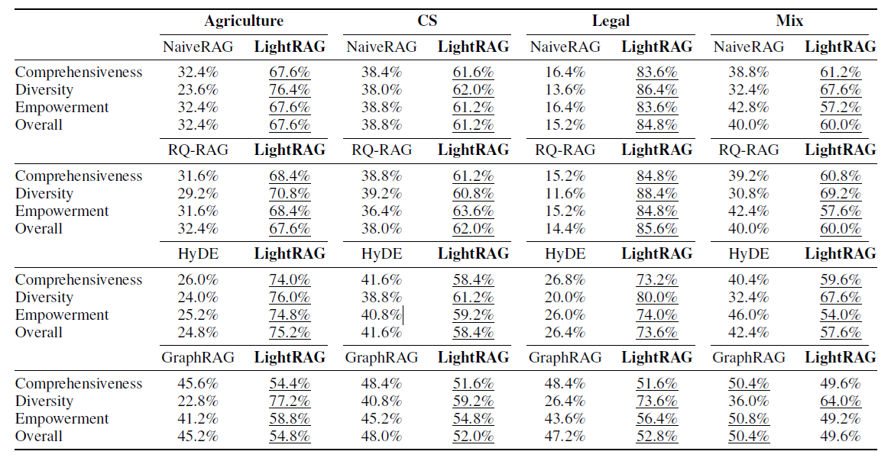

**大規模コーパスにおけるグラフ強化型RAGの優位性 (The Superiority of Graph-enhanced RAG Systems in Large-Scale Corpora)**
大量のトークン数と、データセットの文脈の徹底的な理解を必要とする複雑なクエリを扱う場合、LightRAGやGraphRAGのようなグラフベースのRAGシステムは、NaiveRAG、HyDE、RQ-RAGのような純粋なチャンクベースの検索手法を一貫して上回ります。このパフォーマンスの差は、データセットのサイズが大きくなるにつれて特に顕著になります。例えば、最大のデータセットであるLegalでは、その格差は大幅に広がり、ベースライン手法の勝率が約20%にとどまるのに対し、LightRAGが優位を占めています。この傾向は、大規模コーパス内の複雑な意味的依存関係を捉え、知識のより包括的な理解を促進し、汎化性能の向上につながるという、グラフ強化型RAGシステムの利点を強調しています。

**LightRAGによる応答の多様性の向上 (Enhancing Response Diversity with LightRAG)**
様々なベースラインと比較して、LightRAGは「多様性 (Diversity)」指標において、特により大規模なLegalデータセット内で顕著な利点を示しています。この分野における一貫したリードは、特に多様なコンテンツが不可欠なシナリオにおいて、より幅広い応答を生成するLightRAGの有効性を強調しています。我々はこの利点を、ローレベルとハイレベルの両方の次元からの包括的な情報検索を容易にするLightRAGのデュアルレベル検索パラダイムに起因するものと考えています。このアプローチは、グラフベースのテキストインデックス作成を効果的に活用し、クエリに応じて完全なコンテキストを一貫して捉えます。

**GraphRAGに対するLightRAGの優位性 (LightRAG’s Superiority over GraphRAG)**
LightRAGとGraphRAGはどちらもグラフベースの検索メカニズムを使用していますが、LightRAGは一貫してGraphRAGを上回っており、特に複雑な言語コンテキストを持つ大規模なデータセットにおいてその傾向が顕著です。それぞれ数百万トークンを含むAgriculture、CS、およびLegalデータセットにおいて、LightRAGは明確な利点を示し、GraphRAGを大幅に凌駕しており、多様な環境における包括的な情報理解におけるその強みを浮き彫りにしています。**応答の多様性の向上 (Enhanced Response Variety)**: 特定のエンティティのローレベル検索と、より広範なトピックのハイレベル検索を統合することで、LightRAGは応答の多様性を高めます。このデュアルレベルのメカニズムは、詳細なクエリと抽象的なクエリの両方に効果的に対処し、情報の徹底的な把握を保証します。**複雑なクエリの処理 (Complex Query Handling)**: このアプローチは、多様な視点を必要とするシナリオにおいて特に価値があります。特定の詳細と包括的なテーマの両方にアクセスすることで、LightRAGは相互に関連するトピックを含む複雑なクエリに巧みに応答し、文脈に関連した回答を提供します。

### 4.3 アブレーションスタディ (RQ2)

また、LightRAGにおけるデュアルレベル検索パラダイムの影響と、グラフベースのテキストインデックス作成の有効性を評価するために、アブレーションスタディを実施しました。結果を表2に示します。

**デュアルレベル検索パラダイムの有効性 (Effectiveness of Dual-level Retrieval Paradigm)**
まず、ローレベルおよびハイレベル検索パラダイムの効果を分析します。4つのデータセットにおいて、それぞれ1つのモジュールを省略した2つのアブレーションモデルを、LightRAGと比較しました。以下は、異なるバリアントに関する主な観察結果です：

**表2: LightRAGのアブレーション版のパフォーマンス（NaiveRAGを基準とする勝率）**
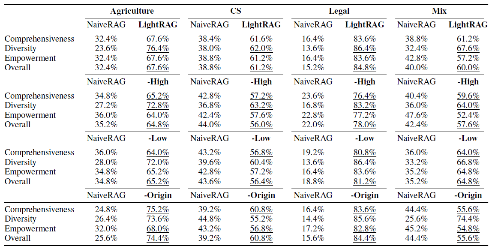

- **ローレベル検索のみ (Low-level-only Retrieval)**: **-High** バリアントは高次検索を削除しており、ほぼすべてのデータセットと指標においてパフォーマンスの大幅な低下をもたらします。この低下は、主に特定の情報に重点を置いており、エンティティとその直接の隣人に過度に焦点を当てているためです。このアプローチは直接関連するエンティティのより深い調査を可能にしますが、包括的な洞察を必要とする複雑なクエリのための情報を収集するのに苦労します。

- **ハイレベル検索のみ (High-level-only Retrieval)**: **-Low** バリアントは、特定のエンティティに焦点を当てるのではなく、エンティティ間の関係を活用することで、より広範なコンテンツを捉えることを優先します。このアプローチは包括性において大きな利点を提供し、より広範で多様な情報を収集することを可能にします。しかし、トレードオフとして特定のエンティティを調査する深さが減少し、非常に詳細な洞察を提供する能力が制限される可能性があります。その結果、このハイレベル検索のみの手法は、正確で詳細な回答を必要とするタスクに苦労する可能性があります。

- **ハイブリッドモード (Hybrid Mode)**: ハイブリッドモード、すなわちLightRAGの完全版は、ローレベルとハイレベルの両方の検索手法の長所を組み合わせています。特定のエンティティの詳細な調査を行いながら、同時により広範な関係セットを取得します。このデュアルレベルのアプローチは、検索プロセスにおける広さと分析における深さの両方を保証し、データの包括的なビューを提供します。その結果、LightRAGは複数の次元にわたってバランスの取れたパフォーマンスを達成します。

**セマンティックグラフはRAGにおいて優れている (Semantic Graph Excels in RAG)**
我々は検索プロセスにおいて原文テキストの使用を排除しました。驚くべきことに、その結果生じたバリアント **-Origin** は、4つのデータセットすべてにおいて、パフォーマンスの著しい低下を示しませんでした。一部のケース（例えばAgricultureやMix）では、このバリアントは改善さえ示しています。我々はこの現象を、グラフベースのインデックス作成プロセスにおける重要な情報の効果的な抽出に起因すると考えており、これがクエリに回答するための十分なコンテキストを提供しています。さらに、原文テキストにはしばしば無関係な情報が含まれており、それが回答にノイズをもたらす可能性があります。

### 4.4 ケーススタディ (RQ3)

ベースライン手法とLightRAGの明確な比較を提供するために、表3に具体的なケース例を示します。これには、競争力のあるベースラインであるGraphRAGと、我々のLightRAGフレームワークの両方からの、機械学習の質問に対する回答が含まれています。この例では、LLMジャッジによって評価されたすべての評価次元（包括性、多様性、権限付与、および総合的な品質）において、LightRAGが優れています。我々の主な観察結果は以下の通りです：

**表3: ケーススタディ: LightRAGとベースライン手法GraphRAGの比較**
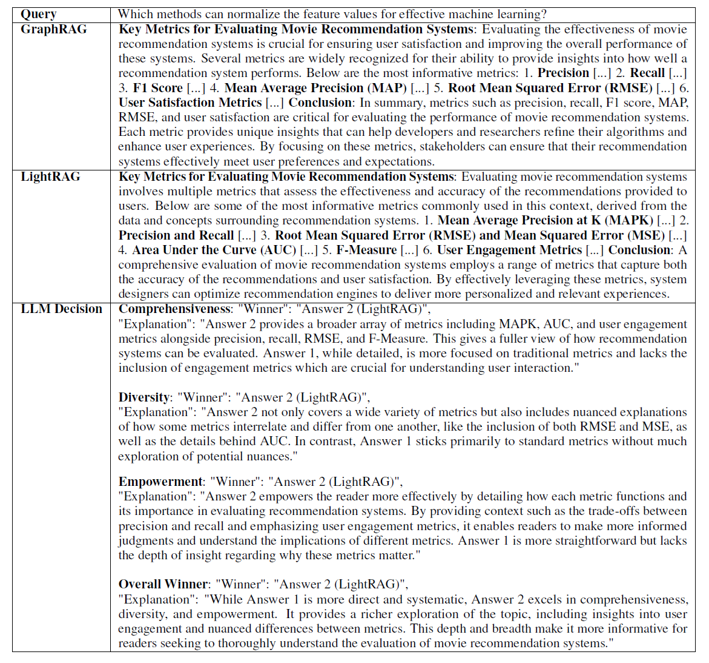

i) **包括性 (Comprehensiveness)**: 特筆すべきことに、LightRAGはより広範な機械学習指標をカバーしており、その包括性と関連情報を効果的に発見する能力を示しています。これは、正確なエンティティおよび関係の抽出とLLMプロファイリングに優れた、我々のグラフベースのインデックス作成パラダイムの強みを浮き彫りにしています。

ii) **多様性と権限付与の両立 (Both Diversity and Empowerment)**: さらに、LightRAGはより多様な情報を提供するだけでなく、より権限を与える（empowering）コンテンツも提供します。この成功は、LightRAGの階層的検索パラダイムによるものです。このパラダイムは、ローレベル検索による関連エンティティの詳細な調査と、ハイレベル検索によるより広範な調査を組み合わせています。これらを組み合わせることで、知識ドメインの包括的なグローバルな視点を捉え、RAGパフォーマンスの向上に貢献しています。

### 4.5 モデルコストと適応性の分析 (RQ4)

**図2: LegalデータセットにおけるGraphRAGとLightRAGのコスト比較**
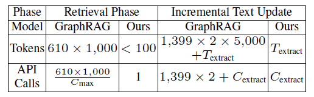

我々のLightRAGのコストを、最もパフォーマンスの高いベースラインであるGraphRAGと比較します。比較は2つの主要な観点から行います。第一に、インデックス作成および検索プロセス中のトークン数とAPIコール数を調査します。第二に、動的な環境におけるデータの変更を処理する際のこれらの指標を分析します。Legalデータセットにおけるこの評価の結果は、表2（※訳注: 文脈から図2を指すと思われる）に示されています。この文脈において、$T_{extract}$ はエンティティおよび関係抽出のためのトークンオーバーヘッドを表し、$C_{max}$ はAPIコールごとの最大許容トークン数を示し、$C_{extract}$ は抽出に必要なAPIコール数を指します。

検索フェーズでは、GraphRAGは1,399のコミュニティを生成し、本実験ではそのうち610のレベル2コミュニティが検索に積極的に使用されました。各コミュニティレポートは平均1,000トークンであり、合計で610,000トークン（610コミュニティ × 1コミュニティあたり1,000トークン）のトークン消費となります。さらに、GraphRAGは各コミュニティを個別に走査する必要があるため、数百回のAPIコールが発生し、検索オーバーヘッドが大幅に増加します。対照的に、LightRAGはキーワード生成と検索に100トークン未満しか使用せず、プロセス全体で1回のAPIコールしか必要としないため、このプロセスを最適化しています。この効率性は、グラフ構造とベクトル表現を情報検索のためにシームレスに統合する我々の検索メカニズムによって達成されており、それにより大量の情報を事前に処理する必要がなくなります。

動的な実世界のシナリオにおける変更に対処するために設計された増分データ更新フェーズでは、両モデルともエンティティおよび関係の抽出において同様のオーバーヘッドを示します。しかし、GraphRAGは新たに追加されたデータを管理する際に大きな非効率性を示しています。Legalデータセットと同じサイズの新しいデータセットが導入された場合、GraphRAGは新しいエンティティと関係を組み込むために既存のコミュニティ構造を解体し、その後完全に再生成する必要があります。このプロセスでは、コミュニティレポートごとに約5,000トークンという多大なトークンコストが発生します。1,399のコミュニティがある場合、GraphRAGは元のコミュニティレポートと新しいコミュニティレポートの両方を再構築するために、約1,399 × 2 × 5,000トークンを必要とします。これは法外な費用であり、その非効率性を強調しています。対照的に、LightRAGは新しく抽出されたエンティティと関係を既存のグラフにシームレスに統合し、完全な再構築を必要としません。このアプローチにより、増分更新中のオーバーヘッドが大幅に削減され、その優れた効率性と費用対効果が実証されています。

---

## 5. 関連研究 (Related Work)

### 5.1 LLMを用いた検索拡張生成 (RAG)
検索拡張生成 (RAG) システムは、外部ソースから関連情報を取得してLLMの入力に加えることで、事実に基づいたドメイン固有の知識で回答を根拠付け（グラウンディング）します。現在のRAGアプローチの多くは、クエリをベクトル空間に埋め込み、最も近いコンテキストベクトルを見つけ出す手法をとっています。しかし、これらの方法の多くは断片的なテキストチャンクに依存し、上位 $k$ 個のコンテキストのみを取得するため、効果的な回答に不可欠な包括的なグローバル情報を捉える能力に限界があります。

最近の研究（Edge et al., 2024）では知識表現にグラフ構造を使用することが探索されていますが、2つの主要な制限が残っています。第一に、これらのアプローチは知識グラフの動的な更新や拡張に対応する能力に欠けていることが多く、新しい情報を効果的に組み込むことが困難です。対照的に、提案するLightRAGは、新しい情報に迅速に適応することを可能にし、システムの適時性と正確性を保証します。第二に、既存の手法は生成されたコミュニティごとに力まかせ探索（brute-force search）に依存することが多く、大規模なクエリに対して非効率的です。LightRAGは、提案するデュアルレベル検索パラダイムを通じてグラフから関連情報を迅速に取得することでこの制限を克服し、検索効率と応答速度の両方を大幅に向上させています。

### 5.2 グラフのための大規模言語モデル
グラフは複雑な関係を表現するための強力なフレームワークであり、多くの分野で応用されています。LLMの進化に伴い、グラフ構造化データの解釈能力を高める研究が活発化しています。これらの研究は主に3つのカテゴリーに分けられます：
1.  **接頭辞としてのGNN**: グラフニューラルネットワーク (GNN) を初期処理レイヤーとして使用し、LLMが推論中に使用できる構造認識トークンを生成します。
2.  **接頭辞としてのLLM**: LLMがテキスト情報を含むグラフデータを処理してノードの埋め込みやラベルを生成し、最終的にGNNの学習プロセスを洗練させます。
3.  **LLMとグラフの統合**: 融合学習やGNNアライメントなどの技術を用い、LLMとグラフデータのシームレスな相互作用を実現することに焦点を当てています。

---

## 6. 結論 (Conclusion)

本研究は、インデックス作成にグラフベースのアプローチを統合することで、情報検索の効率と理解の両方を高める、検索拡張生成 (RAG) の進化を提示しました。LightRAGは包括的な知識グラフを活用して、迅速かつ関連性の高い文書検索を促進し、複雑なクエリのより深い理解を可能にします。そのデュアルレベル検索パラダイムにより、具体的および抽象的な情報の両方を抽出でき、多様なユーザーのニーズに応えます。さらに、LightRAGのシームレスな増分更新機能により、システムは常に最新の状態を保ち、新しい情報に即応できるため、長期にわたってその有効性を維持できます。総じて、LightRAGは効率性と有効性の両面で優れており、LLM推論のコストを削減しながら、情報検索と生成のスピードと品質を大幅に向上させます。

---

## 参考文献 (References)
William Brannon, Suyash Fulay, Hang Jiang, Wonjune Kang, Brandon Roy, Jad Kabbara, and Deb Roy. Congrat: Self-supervised contrastive pretraining for joint graph and text embeddings. arXiv preprint arXiv:2305.14321, 2023.

Chi-Min Chan, Chunpu Xu, Ruibin Yuan, Hongyin Luo, Wei Xue, Yike Guo, and Jie Fu. Rq-rag: Learning to refine queries for retrieval augmented generation. arXiv preprint arXiv:2404.00610, 2024.

Runjin Chen, Tong Zhao, AJAY KUMAR JAISWAL, Neil Shah, and Zhangyang Wang. Llaga: Large language and graph assistant. In International Conference on Machine Learning (ICML), 2024.

Darren Edge, Ha Trinh, Newman Cheng, Joshua Bradley, Alex Chao, Apurva Mody, Steven Truitt, and Jonathan Larson. From local to global: A graph rag approach to query-focused summarization. arXiv preprint arXiv:2404.16130, 2024.

Shahul Es, Jithin James, Luis Espinosa Anke, and Steven Schockaert. Ragas: Automated evaluation of retrieval augmented generation. In International Conference of the European Chapter of the Association for Computational Linguistics (EACL), pp. 150–158, 2024.

Wenqi Fan, Yujuan Ding, Liangbo Ning, Shijie Wang, Hengyun Li, Dawei Yin, Tat-Seng Chua, and Qing Li. A survey on rag meeting llms: Towards retrieval-augmented large language models. In International Conference on Knowledge Discovery and Data Mining (KDD), pp. 6491–6501, 2024.

Luyu Gao, Xueguang Ma, Jimmy Lin, and Jamie Callan. Precise zero-shot dense retrieval without relevance labels. arXiv preprint arXiv:2212.10496, 2022.

Yunfan Gao, Yun Xiong, Xinyu Gao, Kangxiang Jia, Jinliu Pan, Yuxi Bi, Yi Dai, Jiawei Sun, and Haofen Wang. Retrieval-augmented generation for large language models: A survey. arXiv preprint arXiv:2312.10997, 2023.

Yichuan Li, Kaize Ding, and Kyumin Lee. Grenade: Graph-centric language model for self-supervised representation learning on text-attributed graphs. In International Conference on Empirical Methods in Natural Language Processing (EMNLP), pp. 2745–2757, 2023.

Hao Liu, Jiarui Feng, Lecheng Kong, Ningyue Liang, Dacheng Tao, Yixin Chen, and Muhan Zhang. One for all: Towards training one graph model for all classification tasks. In International Conference on Learning Representations (ICLR), 2024.

Yuanjie Lyu, Zhiyu Li, Simin Niu, Feiyu Xiong, Bo Tang, Wenjin Wang, Hao Wu, Huanyong Liu, Tong Xu, and Enhong Chen. Crud-rag: A comprehensive chinese benchmark for retrieval-augmented generation of large language models. arXiv preprint arXiv:2401.17043, 2024.

Hongjin Qian, Peitian Zhang, Zheng Liu, Kelong Mao, and Zhicheng Dou. Memorag: Moving towards next-gen rag via memory-inspired knowledge discovery, 2024. URL https://arxiv.org/abs/2409.05591.

Ori Ram, Yoav Levine, Itay Dalmedigos, Dor Muhlgay, Amnon Shashua, Kevin Leyton-Brown, and Yoav Shoham. In-context retrieval-augmented language models. Transactions of the Association for Computational Linguistics (TACL), 11:1316–1331, 2023.

Ladislav Rampášek, Michael Galkin, Vijay Prakash Dwivedi, Anh Tuan Luu, Guy Wolf, and Dominique Beaini. Recipe for a general, powerful, scalable graph transformer. International Conference on Neural Information Processing Systems (NeurIPS), 35:14501–14515, 2022.

Alireza Salemi and Hamed Zamani. Evaluating retrieval quality in retrieval-augmented generation. In ACM International Conference on Research and Development in Information Retrieval (SIGIR), pp. 2395–2400, 2024.

Viju Sudhi, Sinchana Ramakanth Bhat, Max Rudat, and Roman Teucher. Rag-ex: A generic framework for explaining retrieval augmented generation. In ACM International Conference on Research and Development in Information Retrieval (SIGIR), pp. 2776–2780, 2024.

Jiabin Tang, Yuhao Yang, Wei Wei, Lei Shi, Lixin Su, Suqi Cheng, Dawei Yin, and Chao Huang. Graphgpt: Graph instruction tuning for large language models. In ACM International Conference on Research and Development in Information Retrieval (SIGIR), pp. 491–500, 2024.

Shangqing Tu, Yuanchun Wang, Jifan Yu, Yuyang Xie, Yaran Shi, Xiaozhi Wang, Jing Zhang, Lei Hou, and Juanzi Li. R-eval: A unified toolkit for evaluating domain knowledge of retrieval augmented large language models. In International Conference on Knowledge Discovery and Data Mining (KDD), pp. 5813–5824, 2024.

Han Xie, Da Zheng, Jun Ma, Houyu Zhang, Vassilis N Ioannidis, Xiang Song, Qing Ping, Sheng Wang, Carl Yang, Yi Xu, et al. Graph-aware language model pre-training on a large graph corpus can help multiple graph applications. In International Conference on Knowledge Discovery and Data Mining (KDD), pp. 5270–5281, 2023.

Yue Yu, Wei Ping, Zihan Liu, Boxin Wang, Jiaxuan You, Chao Zhang, Mohammad Shoeybi, and Bryan Catanzaro. Rankrag: Unifying context ranking with retrieval-augmented generation in llms. arXiv preprint arXiv:2407.02485, 2024.

Penghao Zhao, Hailin Zhang, Qinhan Yu, Zhengren Wang, Yunteng Geng, Fangcheng Fu, Ling Yang, Wentao Zhang, and Bin Cui. Retrieval-augmented generation for ai-generated content: A survey. arXiv preprint arXiv:2402.19473, 2024.

---

## 7. 付録 (Appendix)

本セクションでは、LightRAGフレームワークで使用される手法と実験設定について詳述します。ここでは、文書からエンティティと関係性を抽出するための具体的な手順を説明し、その目的のために大規模言語モデル (LLM) がどのように活用されるかを詳述します。また、LLMの操作で使用されるプロンプトテンプレートと設定を明記し、実験設定の明確さを保証します。さらに、LightRAGのパフォーマンスをさまざまな次元からベースラインと比較評価するために使用される評価基準と次元についても概説します。

### 7.1 実験データの詳細 (Experimental Data Details)

表4は、Agriculture、CS、Legal、Mixの4つのデータセットの統計情報を示しています。Agricultureデータセットは12の文書で構成され、合計2,017,886トークン、CSデータセットは10の文書を含み、2,306,535トークンです。Legalデータセットは最大で、94の文書と5,081,069トークンで構成されています。最後に、Mixデータセットには61の文書が含まれ、合計619,009トークンがあります。

**表4: 使用データセットの統計情報**
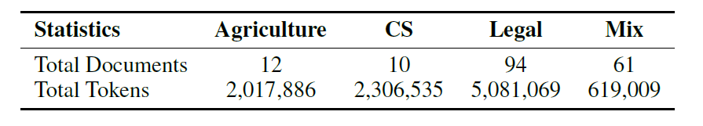

### 7.2 LightRAGにおける検索拡張生成のケース例 (Case Example of Retrieval-Augmented Generation in LightRAG)

図3では、検索して生成する（retrieve-and-generate）プロセスを図解しています。「映画推薦システムを評価するために最も有益な指標は何ですか？」というクエリが提示されると、LLMはまずローレベルとハイレベルの両方のキーワードを抽出します。これらのキーワードは、生成された知識グラフ上のデュアルレベル検索プロセスを導き、関連するエンティティと関係性をターゲットにします。取得された情報は、エンティティ、関係性、および対応するテキストチャンクの3つのコンポーネントに整理されます。この構造化データはその後LLMに入力され、クエリに対する包括的な回答を生成することを可能にします。

**図3: 検索および生成の例**
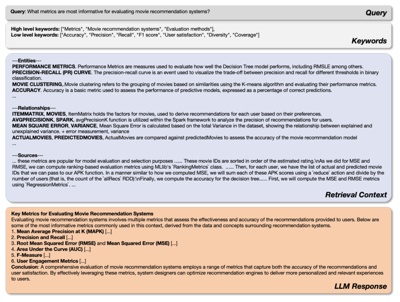

### 7.3 LightRAGで使用されるプロンプトの概要 (Overview of the Prompts Used in LightRAG)

#### 7.3.1 グラフ生成のためのプロンプト (Prompts for Graph Generation)

図4に概説されているグラフ構築プロンプトは、指定されたエンティティタイプに基づいて、テキスト文書からエンティティと関係性の情報を抽出し構造化するように設計されています。プロセスは、エンティティを特定し、それらを組織、人物、場所、イベントなどのタイプに分類することから始まります。次に、それらの属性と活動の詳細な説明を提供します。続いて、プロンプトはこれらのエンティティ間の関係性を特定し、説明を提供し、強度スコアを割り当て、ハイレベルなキーワードを使用して関係性を要約します。

**図4: グラフ生成のためのプロンプト**
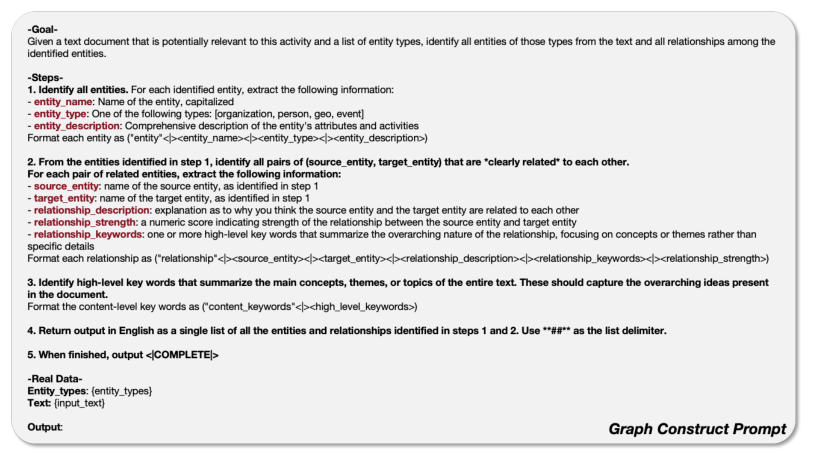

#### 7.3.2 クエリ生成のためのプロンプト (Prompts for Query Generation)

図5において、クエリ生成プロンプトは、指定されたデータセットの説明に基づいて、潜在的なユーザーロール（例：データサイエンティスト、財務アナリスト、プロダクトマネージャー）と、クエリを生成するための彼らの目的を特定するためのフレームワークを概説しています。このプロンプトは、データセットとの対話から利益を得るであろう5人の異なるユーザーを定義する方法を説明しています。各ユーザーについて、データセットを使って作業する際に実行する5つの主要なタスクを指定します。さらに、各（ユーザー、タスク）の組み合わせに対して、データセットの徹底的な理解を確実にするために、5つのハイレベルな質問が提示されます。

**図5: クエリ生成のためのプロンプト**
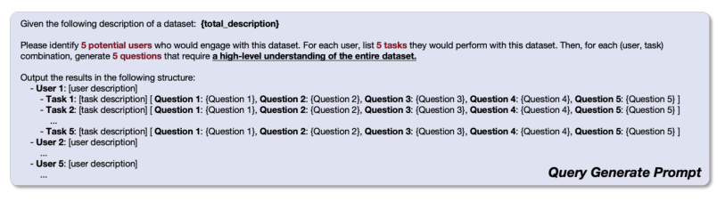

#### 7.3.3 キーワード抽出のためのプロンプト (Prompts for Keyword Extraction)

図6では、プロンプトはユーザーのクエリからキーワードを抽出する方法を記述しており、ハイレベルキーワードとローレベルキーワードを区別しています。ハイレベルキーワードは広範な概念やテーマを表し、ローレベルキーワードは特定のエンティティや詳細に焦点を当てています。抽出されたキーワードはJSON形式で返され、全体的なアイデアのための「high_level_keywords」と、特定の詳細のための「low_level_keywords」の2つのフィールドに整理されます。

**図6: キーワード抽出のためのプロンプト**
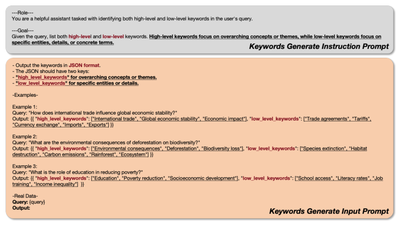

#### 7.3.4 RAG評価のためのプロンプト (Prompts for RAG Evaluation)

評価プロンプトは図7に示されています。これは、包括性 (Comprehensiveness)、多様性 (Diversity)、権限付与 (Empowerment) の3つの主要な基準に基づいて、同じ質問に対する2つの回答を比較するための包括的な評価フレームワークを導入しています。その目的は、各基準についてより優れた回答を選択するプロセスを通じてLLMをガイドし、続いて総合的な評価を行うことです。3つの基準のそれぞれについて、LLMはどちらの回答が優れているかを特定し、その選択の根拠を提供しなければなりません。最終的に、3つの次元すべてにわたるパフォーマンスに基づいて総合的な勝者が決定され、決定を正当化する詳細な要約が添付されます。評価はJSON形式で構造化されており、明確さと一貫性を保証し、2つの回答間の体系的な比較を容易にします。

**図7: RAG評価のためのプロンプト**
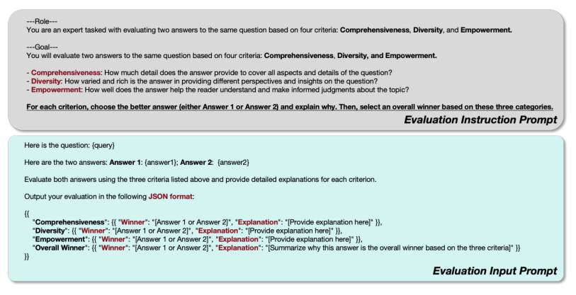

### 7.4 ケーススタディ: LightRAGとベースラインNaiveRAGの比較 (Case Study: Comparison Between LightRAG and the Baseline NaiveRAG)

包括性、権限付与、および多様性の観点から、ベースラインモデルに対するLightRAGの優位性をさらに説明するために、表5にLightRAGとNaiveRAGを比較したケーススタディを提示します。この研究は、企業の合併・買収（M&A）の文脈における先住民族の視点に関する質問を扱っています。注目すべき点として、LightRAGは、文化的意義、協調、法的枠組みといった先住民族の視点に関連する主要なテーマについて、具体的で例示的な例に支えられた、より深い探求を提供しています。対照的に、NaiveRAGは有益な回答を提供しますが、先住民族の所有権と協調のさまざまな次元を徹底的に検討するために必要な深さを欠いています。LightRAGによって採用されたデュアルレベル検索プロセスは、特定のエンティティとその相互関係のより包括的な調査を可能にし、トピック内の全体的なテーマと複雑さを効果的に捉える広範な検索を促進します。

**表5: ケーススタディ: NaiveRAGとLightRAGの比較**
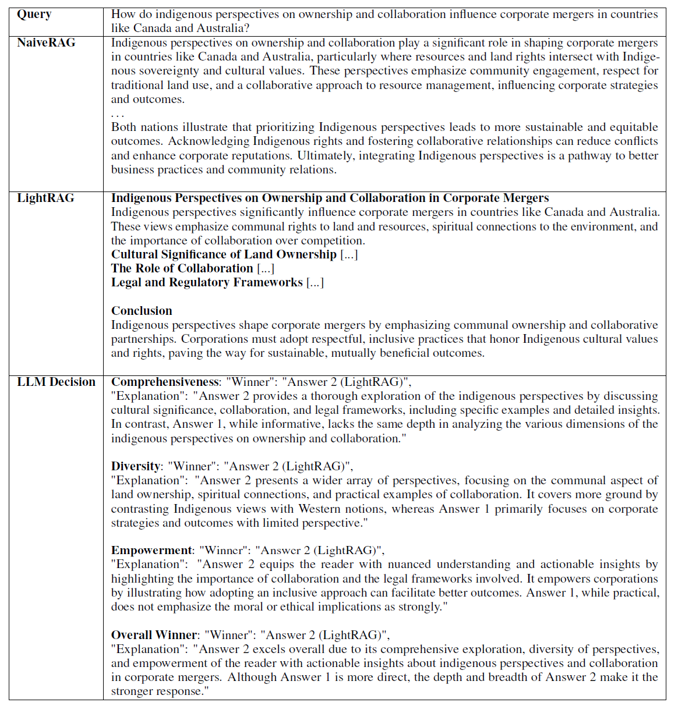

