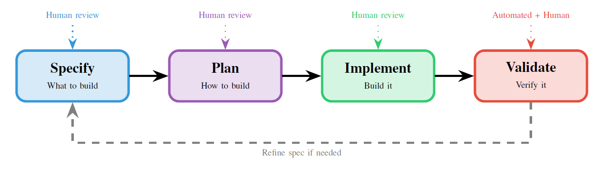

# 仕様駆動開発：AIコーディングアシスタント時代におけるコードから契約への転換

> **[CC BY 4.0]** [Spec-Driven Development: From Code to Contract in the Age of AI Coding Assistants](https://www.arxiv.org/abs/2602.00180)

**Deepak Babu Piskala**  
アメリカ合衆国、シアトル  
テクニカルレポート

## 要約 (Abstract)

AIコーディングアシスタントの台頭により、古くからの問いが再び注目を集めている。「コードではなく、仕様（Specification）をソフトウェア開発の主要な成果物としたらどうなるか？」という問いだ。仕様駆動開発（Spec-Driven Development, SDD）は、仕様を「真実のソース（Source of Truth）」として扱い、コードをそこから生成または検証される二次的な成果物と見なすことで、従来のワークフローを反転させる。本稿は実務家向けに、SDDの原則、ワークフローパターン、およびそれを支えるツールを網羅した包括的なガイドを提供する。

我々は仕様の厳密さを3つのレベル――「スペック・ファースト（Spec-first）」、「スペック・アンカー（Spec-anchored）」、「スペック・アス・ソース（Spec-as-source）」――に分類し、それぞれの適用場面について明確な指針を示す。振る舞い駆動開発（BDD）フレームワークから、GitHub Spec Kitのような最新のAI支援ツールキットに至るまでの分析を通じて、スペック・ファーストの理念がいかに実際の実装にマッピングされるかを実証する。また、API開発、エンタープライズシステム、組み込みソフトウェアのケーススタディを提示し、異なるドメインでのSDDの適用例を示す。最後に、実務家がSDDの価値を判断し、よりシンプルなアプローチで十分な場面を見極めるための意思決定フレームワークを提示して締めくくる。

**索引語** — 仕様駆動開発 (SDD)、AI支援コーディング、振る舞い駆動開発 (BDD)、テスト駆動開発 (TDD)、APIデザインファースト、ソフトウェア仕様

---

## 目次 (Table of Contents)

- [I. 導入 (INTRODUCTION)](#i-導入-introduction)
- [II. 仕様のスペクトラム (THE SPECIFICATION SPECTRUM)](#ii-仕様のスペクトラム-the-specification-spectrum)
- [III. SDDのワークフロー (THE SDD WORKFLOW)](#iii-sddのワークフロー-the-sdd-workflow)
- [IV. SDDがいかにAIコーディングエージェントを強化するか (HOW SDD BOOSTS AI CODING AGENTS)](#iv-sddがいかにaiコーディングエージェントを強化するか-how-sdd-boosts-ai-coding-agents)
- [V. ツールとフレームワーク (TOOLS AND FRAMEWORKS)](#v-ツールとフレームワーク-tools-and-frameworks)
- [VI. ケーススタディ (CASE STUDIES)](#vi-ケーススタディ-case-studies)
- [VII. 開発者の仕事の再定義 (THE REDEFINITION OF DEVELOPER WORK)](#vii-開発者の仕事の再定義-the-redefinition-of-developer-work)
- [VIII. SDDをいつ使うべきか (WHEN TO USE SDD)](#viii-sddをいつ使うべきか-when-to-use-sdd)
- [IX. よくある落とし穴 (COMMON PITFALLS)](#ix-よくある落とし穴-common-pitfalls)
- [X. SDD vs 伝統的な設計ドキュメント (SDD VS TRADITIONAL DESIGN DOCUMENTS)](#x-sdd-vs-伝統的な設計ドキュメント-sdd-vs-traditional-design-documents)
- [XI. 既存のプラクティスとの関係 (RELATIONSHIP TO EXISTING PRACTICES)](#xi-既存のプラクティスとの関係-relationship-to-existing-practices)
- [XII. 結論 (CONCLUSION)](#xii-結論-conclusion)
- [参考文献 (REFERENCES)](#参考文献-references)
- [用語集 (Glossary)](#用語集-glossary)

---

## I. 導入 (INTRODUCTION)

数十年にわたり、ソフトウェア開発においてコードは「王」であった。要件定義書は存在するが、実態から乖離していく。設計図は描かれるが、腐敗していく。テストは書かれるが、多くの場合、事後的なものだ。実際に何を行っているかに関わらず、コードがシステムの「事実上の真実（de facto truth）」となる。

このコード中心の現実には代償が伴う。新しい開発者が「この関数は何をすべきか？」と尋ねれば、答えは多くの場合「コードを読め」となる。ステークホルダーが「システムは要件を満たしているか？」と問えば、実装から意図を逆算して解析する必要がある。AIコーディングアシスタントに機能追加を依頼すれば、曖昧なプロンプトから開発者の望みを推測しなければならない。

仕様駆動開発（SDD）[2], [4] はこれに代わる選択肢を提示する。仕様を「真実のソース」とし、コードをそこから派生させるのだ。まずコーディングし、後で文書化する（あるいは全くしない）のではなく、チームは意図された振る舞いの明確な仕様を書き、その仕様に対してコードを生成、実装、または検証する。仕様は、人間とマシンの双方がシステムを理解し、構築し、維持するために使用する「信頼できる記述（authoritative description）」となる。

### A. AIという触媒 (The AI Catalyst)

スペック・ファーストの考え方自体は新しいものではない。テスト駆動開発（TDD）や振る舞い駆動開発（BDD）は何年も前からそれを提唱してきた。しかし、AIコーディングアシスタント[15], [28] の出現により、SDDは新たな重要性を帯びるようになった。問題はシンプルだ。AIモデルはパターンの補完には優れているが、読心術には長けていない。

開発者がAIに「アプリに写真共有機能を追加して」とプロンプトを送る場面を考えてみよう。AIは推測しなければならない。フォーマットは？ 権限モデルは？ サイズ制限は？ クラウドストレージかローカルか？ 圧縮は？ その結果、もっともらしく見えるが、多くの暗黙の前提（その多くは間違っている）に基づいたコードが生成されることがよくある。

これは実務家が「バイブ・コーディング（vibe coding）」と呼ぶものだ。曖昧なプロンプトに依存し、LLMから一貫性のない、あるいは誤った出力を引き出してしまう状態である。AIに曖昧さのない「実行可能な契約（executable contracts）」を提供することで、SDDはコーディングエージェントの信頼性を高め、スケーラブルなソフトウェア作成の新たな道を切り拓く。

ここで、同じ依頼を仕様と共に行う場合を考えてみよう。「ユーザーは10MBまでのJPEGまたはPNG形式の写真をアップロードできる。写真はS3にユーザーIDをプレフィックスとしたキーで保存される。アップローダーのみが自分の写真を削除できる。写真はアップロード時に最大1024pxにリサイズされる。」。AIはこれで、意図に合致したコードを生成するための十分な情報を得たことになる。

> **重要な洞察：核心原則**  
> 仕様駆動開発において、コードは仕様の「実装の詳細」であり、その逆ではない。仕様が意図を宣言し、コードがそれを実現する。

### B. 本稿の構成 (What This Paper Provides)

本稿は、仕様駆動開発の実務家向けガイドである。まず、仕様の厳密さのレベル――スペック・ファースト、スペック・アンカー、スペック・アス・ソース――を明確に定義し、それぞれのアプローチの適用時期を述べる。次に、SDDを実装するための実践的なワークフローを提示し、AI支援の有無にかかわらず、このアプローチがどのように機能するかを検討する。続いて、伝統的なBDDフレームワークから最新のAI支援ツールキットに至るまでのツールとフレームワークの調査を行う。API開発、エンタープライズシステム、組み込みソフトウェアの分野におけるSDDの活用事例をケーススタディで紹介し、最後にSDDが価値を提供する場合と、よりシンプルなアプローチで十分な場合についての指針を提供する。
## II. 仕様のスペクトラム (THE SPECIFICATION SPECTRUM)

すべての仕様駆動型アプローチが同じというわけではない。チームは、それぞれのニーズ、ツール、ドメインの制約に応じて、異なるレベルの厳密さを採用する。図1は、従来のコード・ファースト開発から、完全なスペック・アス・ソースのアプローチまでのスペクトラムを示している。自分のチームが現在このスペクトラムのどこに位置しているか、そしてどこに位置すべきかを理解することが、SDDを効果的に導入するための第一歩となる。


*図1. 仕様のスペクトラム。右に移動するほどコードに対する仕様の権威が高まるが、整合性を維持するために必要な規律も増大する。*

### A. スペック・ファースト：開発初期のガイド (Spec-First)

> **定義：スペック・ファースト (Spec-First)**  
> 開発の初期段階において、コーディングの前に仕様を記述して実装をガイドするアプローチ。コードが完成した後は、仕様は維持される場合もあればされない場合もある。主な価値は、初期段階での明確化にある。

スペック・ファーストは、SDDへの入り口となる。コードを書く前に、開発者やチームはコードが何をすべきかを明確にする。これは通常、受け入れ基準を伴うユーザーストーリー、BDDのシナリオ、または詳細な要件文書として記述される。仕様は実装をガイドするが、コードが書かれテストをパスした後は、仕様は破棄されるか、コードの進化に伴って乖離（ドリフト）していくことが許容される。

スペック・ファーストの定義的な特徴は、実装を開始する前に仕様が書かれることで、開発者がコーディングを始める前に明確な目標を持てるようにすることだ。しかし、実装後はコードが主要な成果物となり、その後の反復（イテレーション）を通じてコードが進化するにつれて、仕様は時代遅れになる可能性がある。このアプローチは、より強力な仕様規律よりもメンテナンスの負担が少ないため、継続的な仕様の維持にコミットできないチームにとっては現実的な選択肢となる。

スペック・ファーストは、AIコーディングアシスタントを使用して新しい機能を初期開発する際に特に効果を発揮する。事前の仕様定義により、AIが要件を推測することを防ぎ、生成されるコードの品質を劇的に向上させることができる。また、プロトタイプや一回限りの機能など、コードと共に仕様を無期限に維持するコストが正当化されない場合にも価値がある。しかし、スペック・ファーストは長期的な乖離を防ぐことはできない。コードベースを長期間保守する場合は、スペック・アンカーのアプローチを検討すべきである。

### B. スペック・アンカー：生きたドキュメント (Spec-Anchored)

> **定義：スペック・アンカー (Spec-Anchored)**  
> システムのライフサイクルを通じて、仕様がコードと共に維持されるアプローチ。振る舞いに変更を加える際は、仕様とコードの両方を更新する必要があり、常に両者の同期を保つ。

スペック・アンカー開発では、仕様をコードベースと共に進化する「生きたドキュメント」として扱う。機能が変更されるときは、仕様が先に更新されるか、あるいはコードと同時に更新される。自動化されたチェック（通常は仕様から派生したテストの形式）によって、仕様とコードの整合性が保たれていることを保証する。両者が乖離した場合、テストが失敗するため、システムのドキュメントがもはやその挙動を反映していないというフィードバックを即座に得ることができる。

このアプローチでは、仕様とコードは対等なパートナーとして共に進化する。テストが両者の整合性を強制し、すべてのコミットで実行される自動テストとしてBDDシナリオが一般的に利用される。仕様は、開発者やステークホルダーが信頼できる「常に最新のドキュメント」として機能する。ただし、この整合性を維持するには、規律とツールのサポートが必要であり、チームは振る舞いが変わるたびに仕様を更新することにコミットしなければならない。

スペック・アンカーは、ほとんどの商用システムにとって最適なバランス（スイートスポット）である。コードを完全に仕様から自動生成することを要求せずに、明確なドキュメントと検証可能な要件という恩恵を享受できる。CucumberのようなBDDフレームワークはこのアプローチを体現しており、チームが人間にとって読みやすいシナリオを書き、それを自動テストとして実行することを可能にする。API開発においては、OpenAPI仕様をSpecmaticのような契約テストツールと組み合わせることで、仕様と実装の間の整合性を同様に実現できる。

### C. スペック・アス・ソース：人間が仕様を編集し、マシンがコードを生成する (Spec-as-Source)

> **定義：スペック・アス・ソース (Spec-as-Source)**  
> 人間が直接編集する唯一の成果物が仕様であるアプローチ。コードは完全に仕様から生成され、手動で修正されることはない。振る舞いを変更する場合は、仕様を変更して再生成することを意味する。

スペック・アス・ソースは、SDDの最も急進的な形態である。仕様は事実上の「ソースコード」となり、より高い抽象度で表現される。開発者は要件と振る舞いの観点で考え、マシンがそれを実行可能なコードへと翻訳する。機能を変更したい場合は、仕様を変更して再生成するのであり、生成されたコードを直接編集することはない。

契約による設計（Design by Contract）[24] の原則に基づいたこのアプローチは、仕様とコードの従来の主従関係を根本的に覆す。仕様が主要な成果物であり、コードは完全にそこから派生したものとなる。手動でのコード編集は禁止されるか、明確に定義された拡張ポイントに限定される。これには、成熟し信頼できる生成ツールが必要である。開発者は、生成されたコードが仕様を正しく実装しているという確信を持たなければならない。その見返りとして、設計によってドリフトが排除される。コードは手動で編集されるのではなく再生成されるため、仕様とコードは構造上常に一致することになる。

スペック・アス・ソースは、OpenAPI仕様からのAPIサーバスタブの生成や、Simulinkモデルからの認定組み込みコードの生成など、コード生成が明確に定義されているドメインではすでに標準的な手法となっている。自動車業界では、エンジニアがSimulinkで制御アルゴリズムを構築し、シミュレーションを通じてモデルレベルで動作を検証し、誰も手作業で編集しない認定Cコードを生成することが日常的に行われている。Tesslのような新興のAIツールは、このアプローチを一般的なソフトウェア開発に拡張することを目指しており、仕様が真に「新しいソースコード」になる未来を象徴している。しかし、スペック・アス・ソースを採用するには生成の品質に対する高い信頼が必要であり、現在はそのような信頼が確立されたドメインにおいてのみ実用的である。
## III. SDDのワークフロー (THE SDD WORKFLOW)

仕様駆動開発は、実際にはどのように機能するのか。具体的なツールは多岐にわたるが、SDDのアプローチ全体を通じて共通のワークフローが浮かび上がる。図2は、その核心となる4つのフェーズを示している。重要な洞察は、各フェーズが次のフェーズを制約しガイドする成果物を生成し、意図から実装に至るまでの説明責任の連鎖を作り出すことにある。


*図2. SDDのワークフロー。各フェーズは次のフェーズをガイドする成果物を生成する。各チェックポイントでの人間によるレビューにより、意図との整合性を確保する。*

### A. フェーズ1：指定 (Specify)

「指定」フェーズは、根本的な問いに答えるものである。「何を構築すべきか？ (What should the software do?)」。出力されるのは、振る舞い、要件、受け入れ基準を記述した「機能仕様（functional specification）」であり、決定的なのは、実装の詳細を規定しないことである。この「何を（what）」と「どうやって（how）」の分離こそが、SDDのパワーの源泉である。

このフェーズでは、チームはユーザーストーリー、シナリオ、受け入れ基準を通じて、ユーザー向けの振る舞いを明確にする。Given/When/Then形式や入出力の例を用いて、成功の定義を定める。ビジネスルールや制約は明示的に捉えられ、エッジケースやエラー条件は実装中に発見されるのではなく、事前に特定される。

仕様の品質が、その後に続くすべての品質を決定する。優れた仕様にはいくつかの特徴がある。それらは「振る舞い中心」であり、手段ではなく何が起きるかを記述している。また、「検証可能」であり、各要件がテスト可能である。そして「曖昧さがない」ため、異なる読者が同じ解釈に到達する。さらに、実装中にAIエージェントを導くための自己チェックが含まれ、主要なケースをカバーするのに十分な「網羅性」を備えている。

> **実務家へのヒント**  
> 曖昧さを排除するために必要な詳細レベルで仕様を書こう。AIや開発者が要件を複数の方法で解釈できる可能性がある場合は、補足説明を追加する。合理的な解釈が一つしかない場合は、過剰に指定してはならない。詳細すぎる記述は、実装を不必要に制約してしまうからだ。

### B. フェーズ2：計画 (Plan)

「計画」フェーズは、別の問いに答える。「どのように構築すべきか？ (How should we build it?)」。機能仕様を受け取り、このフェーズではアーキテクチャ、データモデル、インターフェース、技術選定を網羅した「技術計画（technical plan）」を作成する。仕様が意図を宣言するのに対し、計画は実装に対する制約を宣言する。

計画には、問題に適した技術やフレームワークの選定、コンポーネントのアーキテクチャと境界の定義、データモデルとスキーマの設計、API・メッセージ・契約を含むインターフェースの指定、およびパフォーマンス、セキュリティ、スケーラビリティに関する非機能要件の特定が含まれる。

計画フェーズは「何を」と「どうやって」の架け橋となる。それは、「永続化にはPostgreSQLを使用する」や「すべてのAPIエンドポイントは認証を必要とする」といった、実装が尊重しなければならない制約をコード化する。AIコーディングアシスタントを使用する場合、計画は極めて重要なコンテキストを提供する。AIは何を構築するかだけでなく、システムがどのように構成され、どのような規約に従うべきかを学習する。このコンテキストがなければ、たとえ完璧な機能仕様があっても、組織の標準やアーキテクチャの決定に反するコードが生成されてしまう可能性がある。

### C. フェーズ3：実装 (Implement)

「実装」フェーズでは、計画に従って仕様を実現する、動作するコードを作成する。従来の開発ではここに最も多くの労力が集中していたが、SDD（特にAI支援がある場合）では、このフェーズは大幅に自動化される可能性がある。それでも、人間による監視は不可欠である。

実装は、計画を個別のレビュー可能な「タスク」に分割することから始まる。各タスクは、人間の開発者、AIアシスタント、またはそのハイブリッドなアプローチによって実装される。コードは、仕様と計画の両方に照らしてレビューされ、整合性が検証される。仕様の要件を実行可能なアサーション（表明）としてコード化するために、ユニットテストが記述される。

SDDの重要な原則は、小さく検証されたインクリメント（増分）で作業を進めることである。仕様全体を一度に実装するのではなく、チームは仕事をタスクに分割し、それぞれがテスト可能な機能の一部を提供するようにする。これにより、頻繁なチェックポイントが可能になり、人間が整合性を検証し、問題が深刻化する前に乖離を早期に発見できるようになる。

仕様は、複雑な問題をエージェントのコンテキストウィンドウに合わせたモジュール式のコンポーネントに分解する「スーパープロンプト（super-prompts）」として機能し、AIシステムが単一のプロンプトでは圧倒されてしまうような複雑さを扱えるようにする。

### D. フェーズ4：検証 (Validate)

「検証」フェーズは、最後に残された極めて重要な問いに答える。「コードは実際に仕様を満たしているか？ (Does the code actually meet the spec?)」。検証はループを閉じ、指定されたものが構築されたことを保証する。このフェーズでは、自動化された検証と人間による判断が組み合わされる。

検証には、ユニット、インテグレーション、アクセプタンス（受け入れ）の各レベルでの自動テストの実行、実装に対するBDDシナリオの実行、非機能要件への準拠の確認、および適切な場合にはステークホルダーによる受け入れテストが含まれる。

もし検証によってギャップ（コードが仕様を満たしていないこと）が明らかになった場合、チームは決断を迫られる。「コードを修正する」か「仕様を修正する」かだ。元の仕様が間違っていたり不完全であったりした場合は、仕様を更新するのが正しい選択である。コードが単に有効な仕様を満たしていないだけなら、コードの修正が必要だ。いずれにせよ、仕様が常に「権威」であり続ける。

この規律によって、仕様の信頼性が維持される。違反が検出され対処され、無視されないため、チームは仕様を信頼することができるのである。
## IV. SDDがいかにAIコーディングエージェントを強化するか (HOW SDD BOOSTS AI CODING AGENTS)

GPT-4やClaudeのような大規模言語モデル（LLM）をコーディングエージェントとして使用する場合、最適化され、コンテキストが豊富な入力を受け取れるSDDから多大な恩恵を受ける。仕様は、複雑な問題をエージェントのコンテキストウィンドウに合わせたモジュール式のコンポーネントに分解する「スーパープロンプト（super-prompts）」として機能する。AIエージェントは、要件の遵守状況を確認するためのチェックリストに照らして自己検証を行いながら、仕様からコードを生成することができる。

実証研究[5], [6]は（まだ始まったばかりではあるが）、人間が磨き上げた仕様がLLMによるコード生成の品質を大幅に向上させ、対照研究ではエラーが最大50%削減されることを示唆している。この強化効果は、特にスケーラブルなシナリオで顕著に現れる。仕様によって、依存関係が調整された非重複タスクに対して、複数のエージェントを並列実行することが可能になる。チームは仕様レベルで作業を分割でき、複数のAIエージェントが干渉し合うことなく、異なるコンポーネントを同時に実装できるのである。

課題も残っている。LLMの非決定性（non-determinism）はその一つで、構造化された仕様であっても出力にばらつきが生じることがある。プロパティベーステスト（PBT）などの手法は、実装のバリエーションにかかわらず、仕様に定められた不変条件（invariants）が満たされていることを自動的に検証することで、この問題に対処する。組み込みシステムやその他の安全性が重視されるドメインでは、SDDはLLMによる生成と形式検証（formal verification）を組み合わせ、ISO 26262[25]などの規格への準拠を保証する。全体として、SDDはAIエージェントを「反応的なツール」から「自律的な協力者」へと変貌させ、特にレガシーな制約が仕様としてエンコードされているブラウンフィールド・プロジェクトにおいて効率を高める。

また、「自己仕様化（self-spec）」と呼ばれる新興のアプローチでは、LLM自身がコードを生成する前に自ら仕様を作成する。エージェントはまず、ハイレベルなプロンプトから仕様を作成し、それが人間によってレビュー・洗練された後に、同じあるいは別のエージェントがその仕様に基づいて実装を行う。これにより、計画と実行の間に明確な分離が生まれ、コードが書かれる前に要件の誤解を捉えることができるようになる。
## V. ツールとフレームワーク (TOOLS AND FRAMEWORKS)

伝統的なテストフレームワークから最新のAI支援ツールキットに至るまで、多様なツールが仕様駆動開発を支えている。表Iは、主なカテゴリをまとめたものである。共通のアプローチには、フェーズ分けされたワークフロー（指定、計画、タスク、実装）が含まれ、ツールはVS CodeベースのKiroから、CLI駆動のspec-kit、さらにはスペック・アス・ソースモデルを採用するTesslまで多岐にわたる。

### 表I：仕様駆動開発（SDD）をサポートするツールとフレームワーク

| カテゴリ | 例 | SDDにおける役割 |
| :--- | :--- | :--- |
| **BDDフレームワーク** | Cucumber, SpecFlow, Behave | プレーンな言語（Gherkin）で実行可能な仕様を記述する。 |
| **TDDフレームワーク** | RSpec, JUnit, pytest | 仕様をユニットテストとしてコード化する。 |
| **API仕様ツール** | OpenAPI/Swagger, GraphQL SDL, Protocol Buffers | 契約（契約）を定義し、コードとテストを生成する。 |
| **契約テスト** | Pact, Specmatic | 実装が仕様に適合しているかを検証する。 |
| **AI支援SDD** | GitHub Spec Kit, Amazon Kiro, Tessl | 仕様からコードへの構造化されたAIワークフロー。 |
| **モデルベース設計** [26] | Simulink, SCADE | 組み込みコードを生成する視覚的な仕様。 |

### A. 振る舞い駆動開発（BDD）フレームワーク

BDDフレームワークを使用すると、チームはテストとして実行可能な、自然言語に近い形で仕様を記述できる。標準的なフォーマットは「Gherkin」[16]であり、Given/When/Then（前提/操作/結果）句を用いた構造化されたシナリオを使用する。

```gherkin
Feature: ショッピングカート
  Scenario: 空のカートにアイテムを追加する
    Given カートが空である
    When アイテム「Widget」をカートに追加する
    Then カートには1つのアイテムが入っているべきである
    And そのアイテムは「Widget」であるべきである
```

これらのシナリオは、ステークホルダーが読める「ドキュメント」と、コードを検証する「自動テスト」という2つの目的を果たす。Cucumber [7] (Ruby, Java, JavaScript)、SpecFlow [21] (.NET)、Behave [22] (Python) などのツールは、これらのシナリオをアプリケーションに対して実行し、ビジネス要件と技術的な実装の間のギャップを埋める。

> **実務家へのヒント**  
> BDDシナリオは単なるテストではなく「仕様」である。実装の前に書き、ステークホルダーをその作成に巻き込み、機能の振る舞いに関する権威ある記述として扱うこと。シナリオがパスすれば、システムがドキュメント化された要件を満たしているという確信が得られる。

### B. API仕様ツール

API開発において、仕様駆動型のアプローチは「デザインファースト」または「APIファースト」[23]の名の下で、長年標準的な慣行となっている。OpenAPI [8] (旧Swagger) を使用すると、エンドポイント仕様、リクエスト/レスポンススキーマ、およびサンプルを含む完全なREST APIを定義し、そこからサーバーのスタブ、クライアントSDK、およびドキュメントを生成できる。GraphQL SDL [17] を使用すると、フロントエンドとバックエンドの間の契約となるスキーマで型、クエリ、ミューテーションを定義でき、並行開発が可能になる。

イベント駆動型アーキテクチャについては、AsyncAPI [27] が同様の仕様機能を提供する。Protocol Buffers [18] と gRPC [19] は、サービスインターフェースとメッセージ型の定義を可能にし、型安全なクライアントおよびサーバーコードの自動生成を実現する。

API仕様ツールの利点は明白だ。API仕様が合意されれば、フロントエンドとバックエンドのチームは自信を持って並行して作業を進めることができる。仕様こそが契約であり、仕様に合致する実装は定義上すべて「有効」となる。Pact [20] や Specmatic [9] のような契約テストツールは、実装が実際に仕様と一致しているかの検証を自動化する。

### C. AI支援SDDツール

新しいツール群は、単発の「ただこれをコードにして」というプロンプトよりも、明示的な成果物を伴うマルチステップのプロンプティングが良い結果をもたらすことを認識し、AIコーディングのワークフローを明示的に仕様の周りに構築している。

**GitHub Spec Kit** [1] は、仕様駆動型のAI開発用コマンドを提供するオープンソースのツールキットである。ワークフローは、プロンプトから詳細な仕様を生成する `/specify`、技術アーキテクチャを作成する `/plan`、計画を実装タスクに分割する `/tasks`、そしてタスクごとにコードを生成する実装という4つの明示的なフェーズに従う。各フェーズで人間がレビューと洗練を行い、意図と実装の整合性を維持する。

**Amazon Kiro** [13] は、コード生成を開始する前に、要件定義、設計、タスク作成の各段階を通じてユーザーをガイドする。Kiroは構造化された要件把握と反復的な洗練を重視し、AIが実装を試みる前に明確なコンテキストを持てるようにする。この明示的なステージングにより、AIが指定されていない要件を推測することを防ぐ。

**Tessl** [14] は最も急進的なアプローチをとっている。仕様が維持される成果物であり、コードはそこから再生成される「スペック・アス・ソース」モデルだ。Tesslは、開発者が生成されたコードを編集せず、仕様を編集して再生成する「仕様こそが新しいソースコード」という新興のビジョンを象徴している。

これらのツールは共通の洞察を共有している。それは、計画と実装を分離することで、エージェントが定義された境界内で実行に集中できるようになり、曖昧なプロンプトに伴う非決定性を軽減できるということである。
## VI. ケーススタディ (CASE STUDIES)

### A. ケーススタディ1：APIファーストのマイクロサービス

*   **ドメイン：** 金融サービスのマイクロサービス
*   **パターン：** OpenAPIを用いたスペック・アンカー
*   **成果：** 統合サイクルタイムを75%削減

ある金融サービス企業は、彼らが「インテグレーション地獄（integration hell）」と呼ぶ状況に苦しんでいた。チーム間でAPI契約に関する互換性のない前提を置いていたため、デプロイ時にマイクロサービスが頻繁に失敗していたのである。各チームが孤立してサービスを実装しており、互換性の欠如は統合テストの段階になって初めて表面化し、高価な手戻りを必要としていた。

解決策として、同社はAPIファースト開発を義務付けた。サービスを実装する前に、チームはエンドポイント、リクエスト/レスポンススキーマ、エラー条件を定義したOpenAPI仕様を記述した。利用側のチームはこれらの仕様をレビューし、コーディングが始まる前にフィードバックを提供した。これにより、以前は手遅れになるまで行われていなかった統合に関する議論を前倒し（フロントロード）することができた。

彼らはSpecmatic [9] を使用して仕様からモックサーバーを生成し、バックエンドの作業と並行してフロントエンドの開発を進めることを可能にした。さらに重要なことに、SpecmaticはCI環境において、実装されたサービスが仕様と一致していることを検証した。乖離があればビルドが失敗するため、ドリフトの蓄積を防ぐことができた。

導入後、統合の失敗は劇的に減少した。不整合が本番環境ではなく仕様レビューの段階で捉えられるようになったため、API変更のサイクルタイムが75%削減されたと報告されている。仕様はすべての関係者が信頼する「契約」となり、それまで多くの手戻りを引き起こしていた曖昧さが排除されたのである。

### B. ケーススタディ2：エンタープライズ機能のためのBDD

*   **ドメイン：** エンタープライズ向けプロジェクト管理ソフトウェア
*   **パターン：** Cucumberを用いたスペック・アンカー
*   **成果：** ステークホルダーによる検証可能な要件、要件の曖昧さの軽減

あるエンタープライズソフトウェアチームでは、機能の「完了（done）」の意味について、開発者とプロダクトマネージャーの間で頻繁に意見が食い違っていた。開発者は要件を満たしていると信じて実装するが、QAはそれがプロダクトの期待と一致しないと判断し、どちらの解釈が正しいかという議論が絶えなかった。期待される振る舞いに関する共有された権威ある定義が欠けていたことが、摩擦と手戻りの原因となっていた。

解決策として、チームはすべてのユーザー向け機能にCucumberを採用した。プロダクトマネージャーは、期待される振る舞いをプレーンな言語で記述したGherkinシナリオを作成した。開発者は、これらのシナリオを実行可能なテストとして自動化するためにステップ定義を実装した。すべてのシナリオがパスしたときのみ機能が「完了」したと見なされるようになり、客観的で検証可能な完了の定義が確立された。

Gherkinシナリオは、ビジネスと技術の両方のステークホルダーが読み、検証できる「共通言語」となった。プロダクトマネージャーは、シナリオが自分の意図を捉えているかを確認できるようになった。紛争が生じた際、シナリオが「権威」となった。シナリオが間違っていればステークホルダーの合意の下で更新され、コードが間違っていれば開発者が修正した。これにより、それまで多くの手戻りや対立を引き起こしていた曖昧さが解消された。

### C. ケーススタディ3：モデルベースの組み込み開発

*   **ドメイン：** 自動車のエンジン制御
*   **パターン：** Simulinkを用いたスペック・アス・ソース
*   **成果：** 検証済みの制御ロジック、認定済みのコード生成

ある自動車部品サプライヤーは、ISO 26262安全認証要件を満たすエンジン制御ソフトウェアを開発する必要があった。手動でのコーディングはエラーが発生しやすく、認証にはコードのすべての行を特定の要件まで追跡（トレース）する必要があった。これはコードを手書きする場合、非常に労働集約的なプロセスであった。

チームはMathWorksのSimulink [10] を使用して、制御アルゴリズムをブロック図とステートマシンとしてモデル化した。「モデルが仕様」であり、エンジニアはモデルレベルで挙動をシミュレーションし検証した。これにより、コードが存在する前にアルゴリズムのエラーを捉えることができた。シミュレーションを通じてモデルが検証されると、認定済みのコードジェネレーターを使用して、モデルからコードが自動生成された。

モデルからコードへの生成自体が認定されていたため、生成されたCコードはモデルが指定した通りに動作することが保証された。エンジニアが生成されたコードを編集することはなく、制御ロジックの変更が必要な場合はモデルを変更して再生成した。これにより、検証済みのモデルとデプロイされたコードが、構造上完全に一致した状態に保たれた。

このアプローチは、最も厳密な形でのスペック・アス・ソースを体現している。人間が修正する唯一の成果物は仕様（Simulinkモデル）であり、実装（Cコード）は完全に生成される。組み込みシステムにおけるSDDは、LLMによる生成と形式検証を組み合わせることで安全性の遵守を保証しており、自動車や航空宇宙のようにエラーが致命的になり得るドメインにおいて、仕様がいかに精度を担保するかを示している。
## VII. 開発者の仕事の再定義 (THE REDEFINITION OF DEVELOPER WORK)

SDDは、ソフトウェア開発者であることの意味を根本的に作り変える。開発者が手動のコーディングから、仕様のオーケストレーション、AI出力のレビュー、そしてハイレベルな設計への集中へと移行するにつれ、仕事の本質が再定義されつつある。この移行は効率を向上させる可能性を秘めている一方で、仕様の維持、ツールの習熟、そしてAIの出力が正しいかどうかを判断するために必要な「審美眼」に関する新たな課題をもたらす。

新規開発（グリーンフィールド）プロジェクトにおいて、開発者はコードではなく仕様を通じてシステムを設計するアーキテクトとなる。彼らは要件の抽出、制約の定義、受け入れ基準の策定――すなわち「どうやって」ではなく「何を」――に集中する。AIエージェントは仕様から実装への翻訳を担うが、仕様が実際の要件を捉えていることを保証する責任は依然として人間に残る。

ブラウンフィールド・プロジェクトやレガシーシステムにおいて、SDDは異なる種類の仕事を可能にする。それは、変更を加える前に既存の挙動を仕様としてエンコードすることである。レガシーコードから仕様を抽出することで、チームは文書化されていない挙動を排除しつつ、近代化（モダナイゼーション）の取り組みが必要な機能を保持していることを検証できる。仕様は、古い実装と新しい実装の間の架け橋となるのである。

ユースケースは開発のスペクトラム全体に及ぶ。仕様が初期開発をガイドするグリーンフィールド・プロジェクトから、変更前に既存の挙動を文書化するレガシーシステムへの機能追加、そして安全性が重視されるドメインで精度を保証する組み込みソフトウェアまで。いずれの場合も、開発者の役割は「コードの生産者」から「仕様の著者」兼「AIのオーケストレーター」へとシフトする。
## VIII. SDDをいつ使うべきか (WHEN TO USE SDD)

仕様駆動開発は万能薬ではない。他のあらゆるプラクティスと同様に、コスト（事前の仕様作成の手間、ツールへの投資、規律の要求）と、メリット（明確さ、品質、保守性）が存在する。図3の意思決定フレームワークは、実務家がいつSDDが価値をもたらすかを判断する助けとなる。


*図3. SDDアプローチを選択するための意思決定フレームワーク。自身のニーズに合った厳密さのレベルから開始すること。*

SDDは、AIコーディングアシスタントを使用する場合に明確な価値を発揮する。仕様によって、AIに推測を強いる曖昧さが排除され、出力の品質が劇的に向上するためだ。また、複雑な要件を伴うプロジェクトも、コードが書かれる前にステークホルダーがニーズを満たしているか検証できるため、SDDの恩恵を受ける。複数の保守担当者がいるシステムでは、仕様がチームの入れ替わりを生き抜くドキュメントとして機能する。統合が頻繁なシステムでは、API仕様が並行開発を可能にし、統合の失敗を防ぐ。規制のあるドメインでは、要件から実装までの追跡可能性（トレースアビリティ）が求められるが、SDDはそれを自然に提供する。レガシーの近代化においても、既存の挙動から仕様を抽出することで、確信を持ってクリーンな再実装を行うことができる。

一方で、特定の状況ではSDDは過剰（オーバーキル）になる可能性がある。使い捨てのプロトタイプに、破棄される仕様への投資を行う正当性はない。開発者が一人で、長期的な保守を想定しない短期間のプロジェクトでは、オーバーヘッドがメリットを上回る可能性がある。探索的なコーディング（何を作るべきかまだ分かっていない段階）では、性急な仕様化は学習を妨げてしまう。要件が明白で解釈の余地がないシンプルなCRUDアプリケーションでは、詳細な仕様は価値を付加せずにコストだけを増大させる。

> **重要な洞察：黄金律**  
> 自分のコンテキストにおいて曖昧さを排除できる「最小限の厳密さ」を選択しよう。AI支援による初期開発には「スペック・ファースト」、長期間運用される商用システムには「スペック・アンカー」、生成ツールが成熟し信頼できる場合にのみ「スペック・アス・ソース」を採用すること。

## IX. よくある落とし穴 (COMMON PITFALLS)

SDDを採用するチームは、しばしばそのメリットを損なう予測可能な課題に直面する。

**過剰な仕様化（Over-specification）**は、チームが詳細すぎる仕様を書き、それが実質的に擬似コード（pseudo-code）になってしまった場合に起こる。これは「何を」と「どうやって」を分離するというSDDの目的を台無しにする。仕様がコードのように読めるなら、それは行き過ぎだ。不必要に実装を制約し、仕様を価値あるものにする抽象化のメリットを失っている。

**仕様の腐敗（Specification rot）**は、スペック・アンカーを採用しながら、コードの変更に合わせて仕様を更新しなかった場合に発生する。仕様は現実から乖離し、ドキュメントとしての価値を失い、信頼を損なう。解決策は、仕様とコードが分岐したときにテストを失敗させる自動化された強制メカニズムを導入し、乖離を「静かな蓄積」ではなく「目に見える痛み」に変えることである。

**官僚主義としての仕様（Specification as bureaucracy）**は、仕様が明確化のためのツールではなく、単に埋めるべき書類（フォーム）になってしまった場合に現れる。仕様作成プロセスが理解や品質の向上に寄与せず、単なるオーバーヘッドとなっているなら、チームはシステムを欺くか、あるいは放棄するだろう。仕様は曖昧さを排除するために必要な最小限であるべきであり、包括的なドキュメント化の「練習」であってはならない。

**ツールの複雑さ（Tooling complexity）**は、特に精巧な成果物を生成するAI支援ツールを使用する場合に、チームを圧倒することがある。生成された計画、タスクリスト、中間ドキュメントの山に溺れてしまう可能性がある。解決策は、シンプルに始めて、明らかに役立つ場合にのみツールの複雑さを増していくことだ。価値を生まないプロセスを追加するだけの「カーゴ・カルト的（盲目的）」なワークフローは避けるべきである。

**誤った自信（False confidence）**は、おそらく最も捉えがたい落とし穴だ。仕様テストにパスしたからといって、ソフトウェアが正しいことが保証されるわけではない。それは単に「ソフトウェアが仕様と一致している」ことを保証するだけだ。仕様自体が間違っていれば、コードは忠実に間違ったものを実装する。仕様もコードと同様に注意深いレビューが必要であり、要件に関する人間の判断を不要にする魔法の弾丸ではない。

## X. SDD vs 伝統的な設計ドキュメント

「SDDは、ソフトウェア工学で常に使われてきた伝統的な基本設計書（HLD）や詳細設計書（LLD）と何が違うのか？」という当然の疑問が湧くだろう。結局のところ、HLDはアーキテクチャを記述し、LLDは実装を詳述し、要件定義書は機能を規定している。これらもすでに仕様ではないのか？

答えはニュアンスに富んでいる。伝統的な設計書も仕様ではあるが、その違いは「何が書かれているか」ではなく、「それがどのように使われ、コードとの整合性が保たれているか」にある。伝統的なソフトウェア工学も、ソフトウェア要件仕様（SRS）、アーキテクチャのための基本設計、クラス図やアルゴリズムのための詳細設計、API契約のためのインターフェース仕様など、多くの仕様に似た成果物を生み出してきた。

問題は仕様の不在ではなく、それらが「乖離（ドリフト）」することにある。スプリント3までにはHLDは古くなり、リリース2までにはSRSはもはや製品と一致しなくなる。コードが事実上の真実となり、ドキュメントは誰も信頼せず、更新もしない歴史的な遺物と化す。

> **重要な洞察：核心的な違い**  
> 伝統的な設計書は「推奨事項（advisory）」であり、開発者はそれを読み、願わくばそれに一致するコードを書く。一方、SDDの仕様は「強制（enforced）」される。コードが乖離すればテストが失敗し、スペック・アス・ソースではコードは手動編集ではなく再生成される。

SDDが実際に追加する価値は三点ある。第一に、**実行可能な仕様**。伝統的な仕様は人間に読まれるものだが、SDDの仕様はBDDシナリオ、API契約テスト、またはモデルシミュレーションとして実行される。コードが一致しなければビルドが失敗する。第二に、**CI/CDとの統合**。現代のSDDは仕様の検証を継続的インテグレーションに組み込み、すべてのコミットを仕様に照らしてチェックするため、乖離は即座に捉えられる。第三に、**AIによる消費**。伝統的な設計書は人間の読者のために書かれていたが、SDDの仕様はAIコーディングアシスタントが消費できるように構造化されており、曖昧なプロンプトから推測するのではなく、仕様からコードとテストを生成できるようになっている。

SDDは革命（revolution）ではなく、進化（evolution）である。「仕様を先に書き、コードをそこから派生させる」という核心的な洞察は、数十年前からのアジャイルの知恵だ。新しいのは、実行可能な仕様を実用的にする優れたツール、自動化された強制を可能にするCI/CDの成熟、そして仕様の品質が出力の品質を直接決定する「消費者としてのAI」の存在である。Bryan Finster [3] が指摘したように、「SDDは革命ではない……単にBDDをブランディングし直したものだ」。しかし、そのブランディングには目的がある。それは、仕様は「推奨」ではなく「権威」であるべきであり、かつては人間の規律に委ねられていた整合性を、現代のツールが強制できるということを実務家に思い出させることである。

## XI. 既存のプラクティスとの関係

SDDは既存の開発手法を置き換えるものではなく、AI支援開発という文脈においてそれらを拡張し、補完するものである。

**テスト駆動開発（TDD）** [11] は、ユニットレベルでのSDDである。テストを先に書くことは、実装前に期待される振る舞いを定義する「マイクロ仕様」を書くことに他ならない。SDDはこの考え方を、機能、システム、アーキテクチャといったより高いレベルへと拡張し、より広いスコープに「指定ファースト」の規律を適用する。

**振る舞い駆動開発（BDD）** [12] は、現代のSDDの最も直接的な先祖である。Gherkinシナリオは、ビジネス要件と技術的な実装を繋ぐ実行可能な仕様である。AI支援SDDツールが追加するのは、それらの仕様からコードを生成する際の支援であり、シナリオから動作するソフトウェアへの道のりを加速させる。

**ドメイン駆動設計（DDD）**は、「ユビキタス言語」を重視することでSDDと密接に連携する。開発者とステークホルダーの両方が理解できるドメイン用語で書かれた仕様は、すべての関係者にとって意味のある基盤となる。

**アジャイルメソドロジー**はSDDと互換性がある。受け入れ基準を伴うユーザーストーリーは仕様であり、「完了の定義（Definition of Done）」は仕様の一種である。違いはその強調点にある。SDDはこれらの成果物を「推奨」ではなく「権威」として扱い、人間の規律だけに頼るのではなく、自動化を通じて整合性を強制するのである。
## XII. 結論 (CONCLUSION)

仕様駆動開発（SDD）は、仕様とコードの伝統的な主従関係を反転させる。コードを唯一の真実のソースとし、ドキュメントを後付けの考慮事項とするのではなく、SDDは仕様を権威あるものとし、コードをそこから派生したものと位置づける。AIコーディングアシスタントがより有能になるにつれて、この反転はますます重要性を増していく。AIが人間よりも速く仕様からコードを生成できるようになったとき、ボトルネックは「仕様の品質」へとシフトするからである。

仕様は、人間の開発者とAIアシスタントの双方にとって曖昧さを排除し、コストのかかる手戻りを引き起こす推測や誤解を防ぐ。厳密さの3つのレベル――スペック・ファースト、スペック・アンカー、スペック・アス・ソース――は、軽量な初期の明確化から厳密なコード生成まで、プロジェクトの多様なニーズに合わせた選択肢を提供する。BDDフレームワーク、API仕様ツールからAI支援SDDツールキットに至るまで、スペクトラム全体にわたって成熟したツールが存在しており、スペック・ファーストのワークフローは今日すでに実現可能である。チームは、過剰なプロセスを構築するのではなく、自身のコンテキストにおける曖昧さを排除できる最小限の規律を適用すべきである。

SDDは、数十年にわたるTDDおよびBDDの知恵に基づいて構築されており、それらのプラクティスをAI時代の文脈に適応させたものである。そのアイデア自体は新しくないが、仕様をかつてないほど強力なものにするツールとAIの能力が新たに登場したのである。開発者が手動のコーディングから、仕様のオーケストレーション、AI出力のレビュー、そしてハイレベルな設計への集中へと移行するにつれ、仕事の定義は進化しつつある。

ソフトウェアシステムがより複雑になり、AIがより強力になるにつれて、問いは「どのようなコードを書くべきか？」から「どのような仕様を提供すべきか？」へとシフトしていく。仕様駆動開発をマスターしたチームは、AIツールからより多くの価値を引き出すと同時に、複雑なシステムが必要とする明確さと追跡可能性を維持できるだろう。SDDは、コードではなく仕様をソフトウェア開発の主要な成果物とすることで、その問いに体系的に答えるためのフレームワークを提供しているのである。

---

## 参考文献 (REFERENCES)

1. GitHub, "Spec-Driven Development with AI: Get Started with a New Open Source Toolkit," GitHub Blog, 2025.
2. Thoughtworks, "Spec-Driven Development," Technology Radar, Vol. 32, 2025.
3. B. Finster, "5-Minute DevOps: Spec-Driven Development Isn't New," Medium, Nov. 2025.
4. M. Fowler, "Exploring Gen AI: Spec-Driven Development," martinfowler.com, 2025.
5. L. Griffin and R. Carroll, "Spec Driven Development: When Architecture Becomes Executable," InfoQ, Jan. 2026.
6. R. Naszcyniec, "How Spec-Driven Development Improves AI Coding Quality," Red Hat Developer, 2025.
7. Cucumber, "Cucumber Documentation," cucumber.io, 2024.
8. OpenAPI Initiative, "OpenAPI Specification v3.1.0," 2024.
9. Specmatic, "Contract-Driven Development with Specmatic," 2025.
10. MathWorks, "Simulink: Simulation and Model-Based Design," 2024.
11. K. Beck, *Test Driven Development: By Example*, Addison-Wesley, 2002.
12. D. North, "Introducing BDD," dannorth.net, Mar. 2006.
13. Amazon Web Services, "Kiro: Agentic AI Development from Prototype to Production," 2025.
14. Tessl, "Tessl: Make Agents Work in Real Codebases," 2025.
15. GitHub, "GitHub Copilot Documentation," 2024.
16. Cucumber, "Gherkin Reference," 2024.
17. GraphQL Foundation, "GraphQL Specification," 2024.
18. Google, "Protocol Buffers Documentation," 2024.
19. gRPC Authors, "gRPC Documentation," 2024.
20. Pact Foundation, "Pact Documentation," 2024.
21. Reqnroll Contributors, "Reqnroll Documentation," 2024.
22. Behave, "Behave: BDD for Python," 2024.
23. SmartBear, "What Is API-First Development?," Swagger.io, 2024.
24. B. Meyer, "Applying Design by Contract," IEEE Computer, vol. 25, no. 10, pp. 40–51, 1992.
25. ISO, "ISO 26262: Road vehicles – Functional safety," 2018.
26. S. J. Mellor and M. J. Balcer, *Executable UML*, Addison-Wesley, 2002.
27. AsyncAPI Initiative, "AsyncAPI Specification," 2024.
28. M. Chen et al., "Evaluating Large Language Models Trained on Code," arXiv:2107.03374, 2021.

---

# 用語集 (Glossary)

| English Term | Japanese Translation | Notes |
|--------------|----------------------|-------|
| Spec-Driven Development (SDD) | 仕様駆動開発 | 文書の核心となる手法。 |
| Spec-First | スペック・ファースト | 開発初期に仕様を作成し、実装をガイドするレベル。 |
| Spec-Anchored | スペック・アンカー | 仕様とコードを常に同期させ、維持し続けるレベル。 |
| Spec-as-Source | スペック・アス・ソース | 仕様のみを編集し、コードは自動生成される最高レベル。 |
| Source of Truth | 真実の単一のソース / 正義の源 | |
| AI Coding Assistants | AIコーディングアシスタント | GitHub Copilot, Claude Codeなど。 |
| Vibe coding | バイブ・コーディング / 雰囲気コーディング | 曖昧なプロンプトに頼った一貫性のないコーディング。 |
| Executable contracts | 実行可能な契約 | 仕様を自動テスト等で検証可能な形式にしたもの。 |
| Behavior-Driven Development (BDD) | 振る舞い駆動開発 | |
| Test-Driven Development (TDD) | テスト駆動開発 | |
| Design by Contract | 契約による設計 | |
| Brownfield projects | ブラウンフィールド・プロジェクト | 既存のコードベースがあるプロジェクト。 |
| Greenfield projects | グリーンフィールド・プロジェクト | 新規開発プロジェクト。 |
| Spec drift | 仕様の乖離 / ドリフト | コードと仕様がズレること。 |
| Executable specifications | 実行可能な仕様 | BDDシナリオや契約テストなど。 |
| Model-Based Design | モデルベース開発 | Simulinkなどの視覚的仕様を用いる手法。 |

